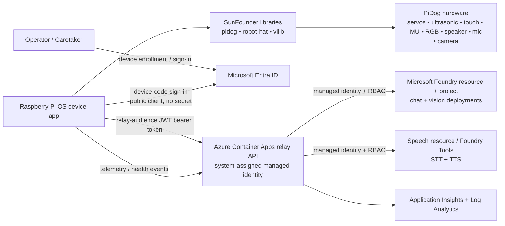
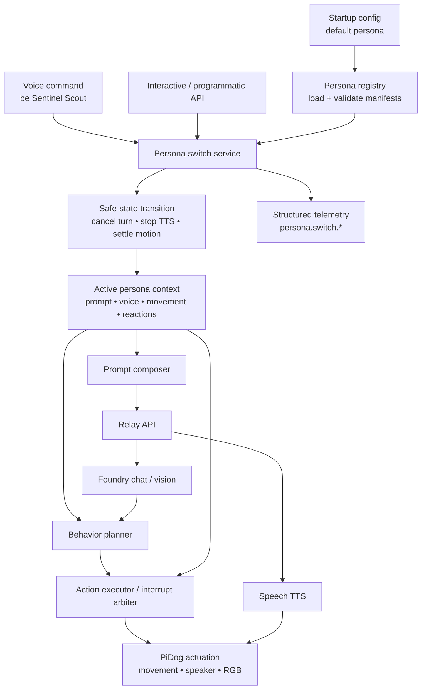

# Sparky Architecture

## Overview

Sparky is an AI-powered robot dog built on the SunFounder PiDog platform. The physical robot runs on Raspberry Pi OS and uses SunFounder’s Python libraries:

- `robot-hat` for low-level board access, audio, GPIO, PWM, I2C, servos, and device utilities
- `pidog` for high-level robot behaviors, motion primitives, sensors, RGB effects, and sound hooks
- `vilib` for camera capture and local vision helpers

The device runtime also applies a local persona framework that shapes prompts, voice, movement, reactions, and sound effects without weakening global safety constraints.

Device application code is layered above a hardware seam: planners call
service-level APIs such as `sparky_device.services.MotionService` and
`sparky_device.services.SensorService` and
`sparky_device.services.CameraService`, services depend only on
`sparky_device.hardware.ports` protocols, and only
`sparky_device.hardware.pidog_adapters` imports SunFounder packages.

Azure provides the cloud intelligence layer:

- chat/reasoning via Microsoft Foundry model deployments
- speech-to-text and text-to-speech via Speech resources integrated with Foundry-era Entra auth patterns
- vision understanding via a multimodal Foundry deployment
- a lightweight relay API in Azure Container Apps so the Pi never calls Azure AI with keys

## Research summary

Based on the current SunFounder docs and repositories:

- PiDog targets **Raspberry Pi OS on Linux** and the vendor packages declare `requires-python >= 3.7`.
- PiDog V2 supports **Raspberry Pi 3/4/5 and Zero 2W**; PiDog V1 does not support Raspberry Pi 5.
- The platform exposes:
  - **12 servos** for legs, head, and tail through the `Pidog` class
  - **camera** access through `vilib`
  - **ultrasonic distance**, **dual touch**, **sound direction**, **IMU**, and **RGB board** sensors/effects
  - **speaker/audio** via Robot HAT and I2S
- A custom application typically imports `Pidog()`, initializes the robot, then composes motion, sensor reads, sounds, and camera/vision flows in Python examples.

## System context



## Keyless authentication design

### Chosen pattern

Sparky uses an **Azure relay service** rather than direct device-to-Foundry calls.

1. The Pi application signs in to a custom API using **Microsoft Entra ID device code flow** as a **public client**.
2. The Pi receives only a relay-audience token such as `api://<relay-app-id>/.default`; it never receives Azure AI bearer tokens, API keys, or connection strings.
3. The relay API validates the device/user token signature, issuer, tenant,
   audience, token lifetime, and required app role/scope or enrolled-device
   claim before it dispatches any endpoint.
4. The relay API uses its **system-assigned managed identity** to request `https://cognitiveservices.azure.com/.default` tokens for Foundry model inference and Speech STT/TTS calls.
5. RBAC grants the relay only the required `Cognitive Services User` access on the AI Services and Speech resources.

### Relay API surface

The relay core is implemented as a framework-neutral Python dispatcher so unit
and contract tests can run in CI with only the stdlib and test-only
dependencies installed. Optional web framework adapters must stay thin and must
not be imported by the core path.

Authenticated endpoints:

| Method | Path | Purpose |
| --- | --- | --- |
| `GET` | `/health` | Authenticated relay health. It returns only `status`, `authenticated`, and the correlation ID; it deliberately does not expose tenant, audience, model, region, or resource configuration. Platform liveness probes should use a separate adapter-level probe if they need an anonymous check. |
| `POST` | `/ai/chat` | Relay-shaped chat request to Foundry using the relay managed identity. |
| `POST` | `/ai/vision` | Relay-shaped image analysis request to Foundry using the relay managed identity. |
| `POST` | `/speech/synthesize` | Relay-shaped text-to-speech request to Speech using the relay managed identity. |
| `POST` | `/speech/recognize` | Relay-shaped speech-to-text request to Speech short-audio REST recognition using the relay managed identity. |

The vision path is implemented as a downstream perception adapter rather than
inside the dispatcher. The relay validates the device token, acquires a
managed-identity bearer credential for the Foundry scope, and passes only that
relay-owned credential into the adapter. The adapter builds a chat-completions
vision request with the caller's base64 image as a data URI plus an optional
prompt, posts it to the configured Foundry endpoint/deployment, and normalizes
the model response into the stable device contract: top-level `caption`,
`labels`, `status`, `correlation_id`, and a `metadata` block with latency,
token usage, model/deployment, and any failure details.

Adapter failures remain device-consumable responses. Timeouts, transport
failures, non-success downstream statuses, malformed responses, empty model
results, and safety-filtered results return an explicit failure `status` with
empty `caption` and `labels`, rather than leaking service exceptions through
the relay boundary.

The Speech recognition path mirrors the synthesis adapter but uses the short-audio
REST endpoint instead of the Speech SDK so the relay core remains stdlib-only.
The device posts JSON to `POST /speech/recognize` with base64 WAV/PCM audio in
`audio`; the relay validates the caller token, obtains its own managed-identity
token for `https://cognitiveservices.azure.com/.default`, decodes the audio, and
posts raw bytes to:

```text
{SPARKY_SPEECH_ENDPOINT}/stt/speech/recognition/conversation/cognitiveservices/v1?language={SPARKY_SPEECH_RECOGNITION_LANGUAGE}&format=detailed
```

Microsoft Learn's current short-audio REST documentation includes the `/stt/`
prefix in the endpoint path, which corrects the earlier assumed path without
that segment. The default downstream content type is
`audio/wav; codecs=audio/pcm; samplerate=16000`; this matches the documented
16 kHz mono PCM WAV short-audio format. Successful detailed responses are
normalized to top-level `transcript`, `confidence`, `correlation_id`, and
`metadata.latency_ms` / `metadata.recognition_status`. Failure results use an
empty transcript, `confidence: 0.0`, `status`, and `metadata.failure`, with
`NoMatch`, `InitialSilenceTimeout`, and `BabbleTimeout` mapped to `no_match`.
Downstream error bodies are never echoed back to callers.

Speech Entra authentication requires a Speech resource custom subdomain such as
`https://<custom-name>.cognitiveservices.azure.com`, plus `Cognitive Services
User` or equivalent RBAC for the relay managed identity. SDK-native Entra auth
uses `TokenCredential` with that custom-domain endpoint; Sparky currently uses
REST to avoid adding the `azure-cognitiveservices-speech` dependency to the
stdlib relay core. If a future feature needs SDK-only streaming or custom speech,
that dependency must be isolated outside the core and must still use managed
identity rather than keys. The REST short-audio path is limited to final results,
short direct audio payloads, and the documented WAV/OGG input formats; batch
transcription, custom speech, and partial results require different Speech APIs
or SDK surfaces.

Authentication failures return structured `401` responses with a generic reason
and the request correlation ID. Authorization failures, such as a valid token
missing the required app role/scope or enrolled-device claim, return `403`.
Neither path echoes bearer values, claim dumps, managed-identity tokens, or
credential-shaped material.

Every request accepts `x-correlation-id`; otherwise the relay generates one and
returns it on the response. The core also exposes a process-local rate-limiter
hook and a post-auth policy hook so fleet policy, enrollment, or persona-aware
controls can be added without changing endpoint handlers.

### Why not call Foundry directly from the Pi?

Direct device access would either require:

- an Azure AI API key,
- a long-lived client secret,
- or a more complex certificate lifecycle on the Pi.

The relay adds one network hop but gives the project a secure default with centralized:

- policy enforcement
- observability
- throttling
- prompt/template management
- future multi-dog fleet controls

## Concrete Azure resource list

The baseline deployment should provision:

1. **Microsoft Foundry resource**  
   Top-level Azure AI resource boundary.

2. **Microsoft Foundry project**  
   Project container for runtime configuration and model usage.

3. **Chat model deployment**  
   Baseline reasoning model for command interpretation, personality, and planning.  
   Recommended starting point: a cost-efficient GPT-4.1-class deployment for conversational reasoning.

4. **Vision model deployment**  
   Multimodal deployment used for image/scene understanding from still frames captured on the Pi.  
   Prefer a model that accepts image + text prompts.

5. **Speech resource with custom subdomain**  
   Used for speech-to-text and text-to-speech with Microsoft Entra ID authentication.

6. **Azure Container Apps environment**

7. **Azure Container App: sparky-relay**
   - system-assigned managed identity
   - ingress enabled
   - Entra-protected API surface

8. **Azure Container Registry**
   Stores relay images for code CD.

9. **Application Insights + Log Analytics**
   Cloud telemetry, traces, and diagnostics.

10. **Resource group(s)**
    Dev and prod resources are deployed into the shared Sparky resource group with
    environment-specific names.

## Deployment target and environments

The concrete Azure deployment target is:

| Setting | Value |
| --- | --- |
| Resource group | `rg-sparky` |
| Azure region | South Central US (`southcentralus`) |
| Subscription | Supplied at deploy time through the `AZURE_SUBSCRIPTION_ID` GitHub Actions repository secret or the active `az` CLI subscription |

The subscription ID is intentionally not committed into Bicep, parameter files,
workflow YAML, or public setup snippets. GitHub Actions should read it from the
repository secret `AZURE_SUBSCRIPTION_ID` during OIDC/WIF login, while local
operators should select the same subscription with `az account set --subscription
<subscription-id>` before running group-scope deployments.

Dev and prod are logical environments in the same resource group and region. The
environment boundary is expressed by Bicep parameters, tags, deployment outputs,
GitHub Environments, and resource names rather than by separate resource groups.
See [GitHub Actions Azure deployment setup](deployment-setup.md) for the keyless
OIDC/workload identity federation setup used by deployment workflows.

### Resource naming convention

Use environment-suffixed names so resources remain readable in one resource
group:

- General pattern: `sparky-<resource>-<env>`
- Azure Container Registry: `sparkyscr<env>` because ACR names must be globally
  unique and alphanumeric
- Log Analytics workspace: `sparky-law-<env>`
- Application Insights: `sparky-appi-<env>`
- Container Apps environment: `sparky-cae-<env>`
- Relay Container App: `sparky-relay-<env>`
- Managed identity or identity-bearing app resources: `sparky-mi-<purpose>-<env>`
- Foundry/AI project resources: `sparky-ai-<env>` and `sparky-proj-<env>` where
  provider naming rules permit them

Every deployed resource should carry at least `app=sparky` and `environment=<env>`
tags.

### South Central US availability and caveats

The single-region target is viable for the planned baseline:

- Microsoft Foundry projects are supported in South Central US.
- Foundry Models standard deployments list South Central US support for the
  GPT-4.1 and GPT-4o families that can cover the initial chat and multimodal
  vision needs. Exact model version, deployment type, and quota still need to be
  confirmed immediately before deployment because model capacity is regional.
- Azure Speech supports South Central US for core speech-to-text, text-to-speech,
  speech translation, fast transcription, batch transcription, Whisper batch
  transcription, custom speech training, neural TTS, batch synthesis, custom
  voice, custom voice training, and TTS avatar basics.
- Speech caveats in South Central US: LLM speech features are not listed there,
  MAI voices, HD voices, Azure OpenAI voices, personal voice, voice conversion,
  custom voice HD endpoints, preview voices/styles, and avatar voice sync are not
  available there in the referenced Speech region matrix. Mitigation: use
  standard neural/custom Speech voices in South Central US for M4, or explicitly
  approve an alternate-region Speech/model resource if a later persona requires
  one of those unavailable features.
- Azure Container Apps, Azure Container Registry, Application Insights, and Log
  Analytics are expected to deploy in South Central US for the baseline. Final
  Bicep work should still validate provider registration and SKU availability
  with `az deployment group what-if` before first deployment.

## Repo layout

```text
.
├── src/
│   ├── device/
│   │   ├── sparky_device/      # Pi runtime and hardware adapters
│   │   │   ├── personas/       # Declarative persona manifests and local assets
│   │   │   └── services/       # Planner-facing device services above hardware ports
│   │   └── tests/
│   ├── cloud/
│   │   ├── sparky_relay/       # Entra-protected relay API
│   │   └── tests/
│   └── shared/
│       ├── sparky_contracts/   # Perception DTOs/statuses/prompts/versioning
│       └── tests/
├── infra/
│   ├── modules/
│   ├── environments/
│   │   ├── dev/
│   │   └── prod/
│   └── scripts/
├── docs/
│   ├── adr/
│   └── diagrams/
└── .github/
    └── workflows/
```

## IaC choice

The project should use **Bicep**.

### Justification

- Azure-only scope
- native support for managed identities and RBAC
- simpler bootstrap than Terraform for a greenfield repo
- easy PR validation with `az bicep build` and `what-if`

See [ADR 0002](adr/0002-bicep-for-azure-infrastructure.md).

## CI/CD strategy

Infra and code workflows stay separate. The separation is enforced by path
filters: each pipeline watches only the paths it owns, so an infra change never
starts a code pipeline and vice versa. A meta workflow lints the workflow files
themselves.

### Infra workflows

#### `infra-ci.yml`

Trigger:

- pull requests touching `infra/**`, `docs/deployment-setup.md`, the infra
  policy tests, or either infra workflow file
- manual runs

Responsibilities:

- Bicep lint/build validation
- static checks on parameters/modules
- `what-if` against the target environment when credentials are available
- static infra and workflow policy tests
- block merges on invalid IaC

#### `infra-cd.yml`

Trigger:

- manual `workflow_dispatch` only, with a `dev` / `prod` environment choice

Infra deployment is never automatic. A push to `main` does not mutate Azure;
promotion is an explicit human action gated by a GitHub Environment.

Responsibilities:

- `what-if` before every `az deployment group create`
- Incremental-mode deployment to the selected environment
- environment approvals for prod
- publish deployment outputs used by code delivery

### Code workflows

#### `code-ci.yml`

Trigger:

- pull requests touching `src/**`, `tests/**`, `scripts/**`, `docs/**`,
  `README.md`, or either code workflow file

Responsibilities:

- Python formatting/linting
- unit tests for device, cloud, and shared packages
- mocked hardware tests
- simulator device smoke harness (`python scripts/motion_service_hil.py --ci`)
- API contract tests
- packaging/build checks

#### `code-cd.yml`

Trigger:

- push to `main` affecting `src/**` (deploys `dev`)
- manual `workflow_dispatch` with a `dev` / `prod` environment choice

Responsibilities:

- validate before publishing
- build and publish relay container image to ACR using Entra ID RBAC
- deploy relay to Container Apps
- publish device package/release artifacts for Raspberry Pi installation *(planned — not yet implemented)*

Code delivery never runs `az deployment group create`; it only updates the
Container App that `infra-cd.yml` already provisioned.

### Meta workflows

#### `workflow-lint.yml`

Trigger:

- pull requests and pushes to `main` touching `.github/workflows/**`
- manual runs

Responsibilities:

- run [actionlint](https://github.com/rhysd/actionlint) over every workflow
  file, catching invalid syntax, bad expressions, unknown runner labels, and
  shellcheck findings in `run:` blocks

actionlint is pinned to an exact release and the download is verified against a
recorded SHA-256 checksum. This workflow is deliberately separate from the
infra and code pipelines: linting is cross-cutting, so folding it into either
one would either duplicate the job or reintroduce the broad
`.github/workflows/**` trigger that the path-filter separation removes.

### Workflow auth posture

All four delivery workflows are keyless. Azure access uses GitHub OIDC /
workload identity federation (`permissions: id-token: write` plus `azure/login`
with `client-id`, `tenant-id`, and `subscription-id`). There are no publish
profiles, service principal secrets, storage keys, or ACR admin credentials in
GitHub secrets, and the registry admin user stays disabled. `workflow-lint.yml`
needs no Azure access at all. These rules are enforced by
`tests/test_workflow_policy.py`.


## Persona framework

Sparky supports multiple runtime-switchable personas. A persona is a validated, declarative manifest with a narrow code extension point, not a set of hard-coded planner branches. See [ADR 0004](adr/0004-persona-framework.md) and the starter persona brief in [docs/personas.md](personas.md).

### Definition format and repository location

Personas are declarative-first YAML or JSON manifests validated by a shared JSON Schema. The schema, DTOs, and validators live under `src/shared/sparky_contracts/personas/`. Runtime persona manifests and any approved local assets live under `src/device/sparky_device/personas/`, preserving the project rule that source/runtime content belongs under `/src`.

A persona controls:

- LLM system-prompt intent and behavioral rules
- TTS voice, speaking style, rate, pitch, volume, and fallback voice
- movement profile: gait, speed, posture idioms, idle behaviors, and energy level
- reaction mappings for normalized vision and sensor events
- approved sound effects and RGB idioms
- persona-specific safety notes that may tighten but never override global safety policy

The implementation may expose typed extension points for new reaction handlers or effect adapters, but adding a normal third persona must require only a new manifest plus fixtures/tests, not core code changes.

### Runtime placement and switching flow



Persona switching is a hot-swap operation: the process should not restart, but the switch must first put the robot into a safe transition state. In-flight conversation turns are cancelled or closed, TTS playback is stopped, active motion is interrupted through the action executor, and transient reactions are cleared before the new persona becomes active. Unknown or invalid target personas are rejected without changing the active persona.

Conversation memory is persona-scoped by default. Switching from Sunny Companion to Sentinel Scout starts Sentinel with its own recent-turn window so emotional tone, prompt commitments, or role assumptions do not leak across personas. A future explicit memory-bridging policy can be added later, but it must be global-policy controlled rather than persona-controlled.

Switches must be observable through structured logs/telemetry: previous persona, target persona, trigger source, validation status, transition duration, failure reason, and correlation IDs. Full prompt text should not be logged by default.

### Validation

A persona is valid only when:

- required manifest fields are present and schema version is supported
- voice and style settings exist in the configured Speech voice catalog or approved test catalog
- movement profile values are inside global safe ranges
- reaction event names map to known normalized perception/sensor events
- sound/RGB assets are known and locally available or safely optional
- persona safety notes only add constraints and never weaken global safety, authentication, privacy, or motion limits

Validation runs in CI, during registry startup, and before any runtime switch. Invalid personas remain discoverable as diagnostics but cannot activate.

### Starter personas

The first two personas are designed to exercise the full framework:

1. **Sunny Companion** — warm, friendly companion behavior with gentle voice, relaxed movement, soft greetings, and calm idle poses.
2. **Sentinel Scout** — alert but non-aggressive scout behavior with crisp voice, purposeful patrol movement, inspection reactions, and concise status reports.

They differ across prompt intent, TTS voice/prosody, movement energy, gait, vision-triggered reactions, sound effects, and RGB idioms. Sentinel Scout is explicitly not a threat or enforcement mode; global safety still prevents chasing, intimidation, unsafe motion, or any claim of physical security.

## Testing strategy

Every code issue must include tests.

### Device-side testing

GitHub-hosted runners cannot exercise real PiDog hardware, so the device code must depend on **wrapper interfaces**, not vendor classes directly.

The seam ships in `src/device/sparky_device/hardware/`:

| Module | Contents |
| --- | --- |
| `ports.py` | `MotionPort`, `BoardPort`, `CameraPort`, `SensorPort` protocols, shared value objects, and the `RobotPorts` bundle |
| `simulators.py` | Recording fakes used by unit tests and off-robot development |
| `pidog_adapters.py` | The only code that touches `pidog`, `robot_hat`, `vilib`, and `cv2`, all imported lazily |
| `factory.py` | `create_ports()` and the `SPARKY_HARDWARE` profile switch (`pidog`, `simulator`, `auto`) |

Port responsibilities:

- `MotionPort` wraps `Pidog` actions and leg/head/tail servo moves
- `BoardPort` wraps `robot_hat` features such as speaker and RGB strip
- `CameraPort` wraps `vilib`
- `SensorPort` wraps ultrasonic/touch/IMU/sound-direction reads

Adapters validate speed and servo angles *before* calling the vendor library, so
an out-of-range command is rejected in software rather than sent to a servo.
The service layer then gives planners stable application contracts: motion
intents reject ambiguous queues, while sensor reads become timestamped snapshots
with explicit `ok`, `unavailable`, or `malformed` statuses instead of overloaded
`None` values or escaping hardware exceptions. Camera capture follows the same
pattern: `CameraService` owns start/capture/stop, converts camera absence and
malformed frames into status-bearing results, and packages successful captures
into JSON-friendly device-local `PackagedFrame` values.

Camera packaging is deliberately above the port. `vilib` captures at its native
640x480 only, so the port rejects every other requested resolution before
touching the vendor stack. If a caller asks for smaller upload dimensions,
`CameraService` lazily tries optional Pillow-based resizing; when Pillow is not
installed or fixture bytes cannot be decoded, it sends the original bytes and
records the actual packaged dimensions and detail in metadata. The relay-facing
perception helper converts a `PackagedFrame` into `PerceptionRequest`, whose
wire dictionary includes base64 image bytes under `image`, prompt, media type,
optional correlation ID, and source metadata; packaged dimensions remain
device-local camera metadata rather than part of the shared perception
contract.

Unit tests run against fake implementations:

- persona fixture registry validates starter and sample third personas
- fake motion adapter captures target poses and actions
- fake camera adapter replays stored test images, including disk-backed fixture
  files loaded through the simulator camera
- fake audio adapter replays WAV fixtures and captures synthesized output requests
- fake sensor adapter emits scripted events

CI also runs the non-hardware device smoke harness,
`python scripts/motion_service_hil.py --ci`. That command forces the simulator
profile, skips all vendor imports, exercises motion, sensor, camera, board RGB,
and audio ports through the same checklist runner used on the Pi, and exits
non-zero on any failed required step.

### Persona testing

- schema validation tests for required fields, unknown voices, safe movement ranges, reaction names, sound assets, and attempted safety overrides
- prompt composition tests that prove global rules precede persona instructions
- mocked-hardware switching tests that verify safe-stop, TTS cancellation, state isolation, and per-persona movement/reaction outputs
- extensibility tests proving a third persona manifest can be added without core code changes

### Cloud-side testing

- unit tests for relay authentication, policy, persona-aware TTS request shaping,
  Foundry vision request translation, and other relay request shaping; token
  validation tests cover missing, malformed, bad-signature, wrong issuer, wrong
  tenant, wrong audience (including Microsoft Graph), expired, future-`nbf`,
  and missing-grant paths
- contract tests for request/response schemas on `/health`, `/ai/chat`,
  `/ai/vision`, `/speech/synthesize`, and `/speech/recognize`
- mocked Foundry and Speech relay clients; tests assert the caller's bearer
  token is never forwarded downstream and managed identity is used for the
  relay-to-service hop, including the concrete vision adapter

### Hardware-in-the-loop testing

Not feasible in standard GitHub-hosted CI. Mitigation:

- keep hardware-facing code thin and adapter-based
- run the simulator smoke harness in Code CI for repeatable non-hardware coverage
- define manual or self-hosted Pi smoke tests for milestone acceptance
- record reproducible demo scenarios for final validation

The manual checklist and Pi setup steps live in
[running-on-the-pi.md](running-on-the-pi.md).

Manual relay-auth HIL validation for this issue:

1. On the Pi, configure the relay app registration public-client values and
   request the relay audience scope (`api://<relay-app-id>/.default` or the
   project-specific delegated scope) through device-code sign-in.
2. Call `GET /health`, `POST /ai/chat`, `POST /ai/vision`,
   `POST /speech/synthesize`, and `POST /speech/recognize` with the
   relay-audience bearer token and an `x-correlation-id`; confirm all successful
   responses return the same correlation ID and no configuration details. For
   `/ai/vision`, submit a captured camera frame and confirm the response has
   top-level `caption`, `labels`, `status`, `correlation_id`, and observability
   metadata. For `/speech/recognize`, submit base64-encoded 16 kHz mono PCM WAV
   audio and confirm the response has top-level `transcript`, `confidence`,
   `correlation_id`, and recognition metadata.
3. Repeat one call with no token, a malformed token, an expired token, a token
   for Microsoft Graph, and a validly signed token missing the required
   role/scope or enrolled-device claim; confirm only structured `401`/`403`
   bodies are returned and logs do not contain bearer material.
4. In relay diagnostics, verify downstream Foundry/Speech calls are made with
   the relay Container App managed identity and `Cognitive Services User` RBAC,
   not with the Pi caller token.
5. Run the device checklist in [running-on-the-pi.md](running-on-the-pi.md)
   after relay smoke validation so motion/camera/audio behavior is validated
   against the authenticated cloud path.

Relay follow-up risks:

- The stdlib core now enforces auth and request/response contracts, but a thin
  ASGI/FastAPI adapter still needs deployment wiring and platform liveness
  behavior.
- Production verifier operation depends on Entra signing-key retrieval and
  cache behavior; deployment should monitor verifier failures separately from
  policy denials.
- The first enrolled-device grant convention (app role, delegated scope, or
  custom enrolled-device claim) must be finalized in the relay app registration
  before Pi enrollment runbooks are declared complete.
- Speech synthesis and recognition request shaping are covered by mocked
  transports and fixtures, but live South Central US Speech RBAC, custom-domain
  endpoint behavior, and audio quality still need manual relay-auth HIL
  validation against a deployed dev environment.
- The Foundry vision adapter now has mocked transport coverage, but live
  deployment selection, regional model quota, and safety-filter policy should
  be validated against the target Foundry resource before declaring HIL
  acceptance complete.

## Non-goals for the planning baseline

- Writing production device code
- Writing production Bicep
- Building a mobile app or web dashboard
- Designing private networking from day one

## Open questions

1. Should the first production release use a self-hosted Raspberry Pi runner for nightly smoke tests?
2. Which exact chat and vision deployments best balance latency vs cost on the target budget?
3. Which Speech voices are available in the target region and best match Sunny Companion and Sentinel Scout?
4. How much offline fallback behavior is required when Azure is unreachable?
5. Will multi-dog fleet enrollment be needed, or is a single-device enrollment flow sufficient?
