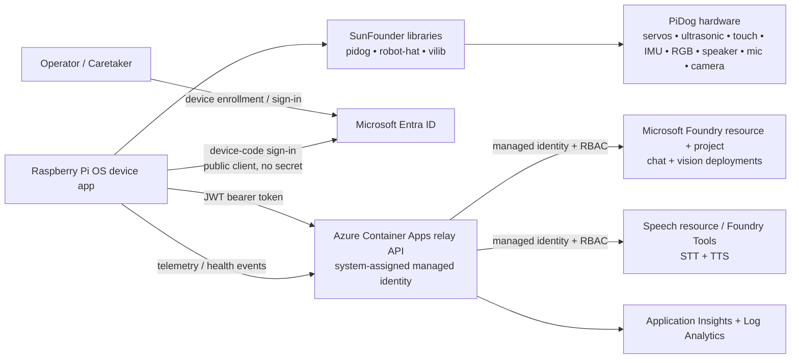
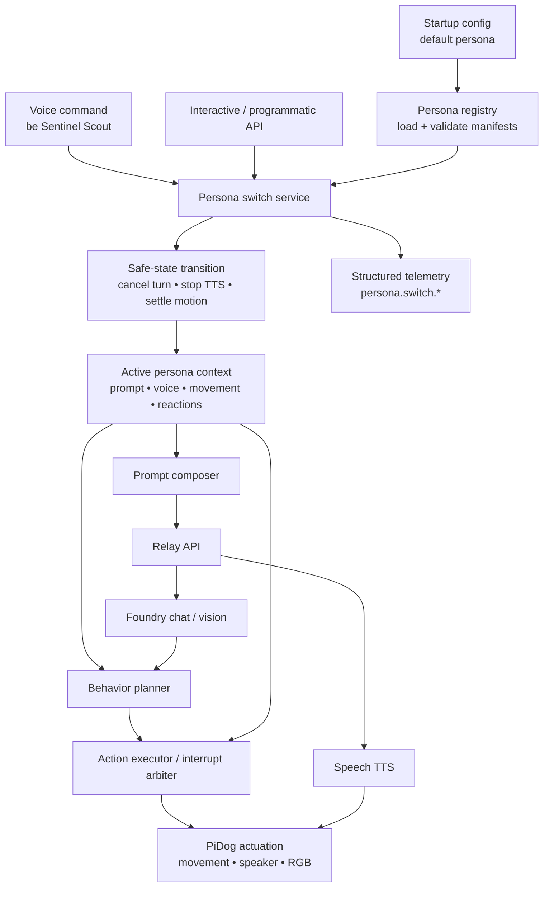

# Sparky Architecture

## Overview

Sparky is an AI-powered robot dog built on the SunFounder PiDog platform. The physical robot runs on Raspberry Pi OS and uses SunFounder’s Python libraries:

- `robot-hat` for low-level board access, audio, GPIO, PWM, I2C, servos, and device utilities
- `pidog` for high-level robot behaviors, motion primitives, sensors, RGB effects, and sound hooks
- `vilib` for camera capture and local vision helpers

The device runtime also applies a local persona framework that shapes prompts, voice, movement, reactions, and sound effects without weakening global safety constraints.

Azure provides the cloud intelligence layer:

- chat/reasoning via Microsoft Foundry model deployments
- speech-to-text and text-to-speech via Speech resources integrated with Foundry-era Entra auth patterns
- vision understanding via a multimodal Foundry deployment
- a lightweight relay API in Azure Container Apps so the Pi never calls Azure AI with keys

## Research summary

Based on the current SunFounder docs and repositories:

- PiDog targets **Raspberry Pi OS on Linux** and the vendor packages declare `requires-python >= 3.7`.
- PiDog V2 supports **Raspberry Pi 3/4/5 and Zero 2W**; PiDog V1 does not support Raspberry Pi 5.
- The platform exposes:
  - **12 servos** for legs, head, and tail through the `Pidog` class
  - **camera** access through `vilib`
  - **ultrasonic distance**, **dual touch**, **sound direction**, **IMU**, and **RGB board** sensors/effects
  - **speaker/audio** via Robot HAT and I2S
- A custom application typically imports `Pidog()`, initializes the robot, then composes motion, sensor reads, sounds, and camera/vision flows in Python examples.

## System context



## Keyless authentication design

### Chosen pattern

Sparky uses an **Azure relay service** rather than direct device-to-Foundry calls.

1. The Pi application signs in to a custom API using **Microsoft Entra ID device code flow** as a **public client**.
2. The relay API validates the device/user token.
3. The relay API uses its **system-assigned managed identity** to request tokens for:
   - `https://ai.azure.com/.default` for Microsoft Foundry model inference
   - the Speech resource custom-domain scope for STT/TTS calls
4. RBAC grants the relay only the required `Cognitive Services User` access.

### Why not call Foundry directly from the Pi?

Direct device access would either require:

- an Azure AI API key,
- a long-lived client secret,
- or a more complex certificate lifecycle on the Pi.

The relay adds one network hop but gives the project a secure default with centralized:

- policy enforcement
- observability
- throttling
- prompt/template management
- future multi-dog fleet controls

## Concrete Azure resource list

The baseline deployment should provision:

1. **Microsoft Foundry resource**  
   Top-level Azure AI resource boundary.

2. **Microsoft Foundry project**  
   Project container for runtime configuration and model usage.

3. **Chat model deployment**  
   Baseline reasoning model for command interpretation, personality, and planning.  
   Recommended starting point: a cost-efficient GPT-4.1-class deployment for conversational reasoning.

4. **Vision model deployment**  
   Multimodal deployment used for image/scene understanding from still frames captured on the Pi.  
   Prefer a model that accepts image + text prompts.

5. **Speech resource with custom subdomain**  
   Used for speech-to-text and text-to-speech with Microsoft Entra ID authentication.

6. **Azure Container Apps environment**

7. **Azure Container App: sparky-relay**
   - system-assigned managed identity
   - ingress enabled
   - Entra-protected API surface

8. **Azure Container Registry**
   Stores relay images for code CD.

9. **Application Insights + Log Analytics**
   Cloud telemetry, traces, and diagnostics.

10. **Resource group(s)**
    Dev and prod resources are deployed into the shared Sparky resource group with
    environment-specific names.

## Deployment target and environments

The concrete Azure deployment target is:

| Setting | Value |
| --- | --- |
| Resource group | `rg-sparky` |
| Azure region | South Central US (`southcentralus`) |
| Subscription | Supplied at deploy time through the `AZURE_SUBSCRIPTION_ID` GitHub Actions repository variable or the active `az` CLI subscription |

The subscription ID is intentionally not committed into Bicep, parameter files,
workflow YAML, or public setup snippets. GitHub Actions should read it from the
repository variable `AZURE_SUBSCRIPTION_ID` during OIDC/WIF login, while local
operators should select the same subscription with `az account set --subscription
<subscription-id>` before running group-scope deployments.

Dev and prod are logical environments in the same resource group and region. The
environment boundary is expressed by Bicep parameters, tags, deployment outputs,
GitHub Environments, and resource names rather than by separate resource groups.

### Resource naming convention

Use environment-suffixed names so resources remain readable in one resource
group:

- General pattern: `sparky-<resource>-<env>`
- Azure Container Registry: `sparkyscr<env>` because ACR names must be globally
  unique and alphanumeric
- Log Analytics workspace: `sparky-law-<env>`
- Application Insights: `sparky-appi-<env>`
- Container Apps environment: `sparky-cae-<env>`
- Relay Container App: `sparky-relay-<env>`
- Managed identity or identity-bearing app resources: `sparky-mi-<purpose>-<env>`
- Foundry/AI project resources: `sparky-ai-<env>` and `sparky-proj-<env>` where
  provider naming rules permit them

Every deployed resource should carry at least `app=sparky` and `environment=<env>`
tags.

### South Central US availability and caveats

The single-region target is viable for the planned baseline:

- Microsoft Foundry projects are supported in South Central US.
- Foundry Models standard deployments list South Central US support for the
  GPT-4.1 and GPT-4o families that can cover the initial chat and multimodal
  vision needs. Exact model version, deployment type, and quota still need to be
  confirmed immediately before deployment because model capacity is regional.
- Azure Speech supports South Central US for core speech-to-text, text-to-speech,
  speech translation, fast transcription, batch transcription, Whisper batch
  transcription, custom speech training, neural TTS, batch synthesis, custom
  voice, custom voice training, and TTS avatar basics.
- Speech caveats in South Central US: LLM speech features are not listed there,
  MAI voices, HD voices, Azure OpenAI voices, personal voice, voice conversion,
  custom voice HD endpoints, preview voices/styles, and avatar voice sync are not
  available there in the referenced Speech region matrix. Mitigation: use
  standard neural/custom Speech voices in South Central US for M4, or explicitly
  approve an alternate-region Speech/model resource if a later persona requires
  one of those unavailable features.
- Azure Container Apps, Azure Container Registry, Application Insights, and Log
  Analytics are expected to deploy in South Central US for the baseline. Final
  Bicep work should still validate provider registration and SKU availability
  with `az deployment group what-if` before first deployment.

## Repo layout

```text
.
├── src/
│   ├── device/
│   │   ├── sparky_device/      # Pi runtime and hardware adapters
│   │   │   └── personas/       # Declarative persona manifests and local assets
│   │   └── tests/
│   ├── cloud/
│   │   ├── sparky_relay/       # Entra-protected relay API
│   │   └── tests/
│   └── shared/
│       ├── sparky_contracts/   # DTOs, schemas, persona validation, prompts, config helpers
│       └── tests/
├── infra/
│   ├── modules/
│   ├── environments/
│   │   ├── dev/
│   │   └── prod/
│   └── scripts/
├── docs/
│   ├── adr/
│   └── diagrams/
└── .github/
    └── workflows/
```

## IaC choice

The project should use **Bicep**.

### Justification

- Azure-only scope
- native support for managed identities and RBAC
- simpler bootstrap than Terraform for a greenfield repo
- easy PR validation with `az bicep build` and `what-if`

See [ADR 0002](adr/0002-bicep-for-azure-infrastructure.md).

## CI/CD strategy

Infra and code workflows stay separate.

### Infra workflows

#### `infra-ci.yml`

Trigger:

- pull requests touching `infra/**`
- manual runs

Responsibilities:

- Bicep lint/build validation
- static checks on parameters/modules
- `what-if` against the target environment when credentials are available
- block merges on invalid IaC

#### `infra-cd.yml`

Trigger:

- push to `main` affecting `infra/**`
- manual promotion to higher environments

Responsibilities:

- deploy Bicep to dev
- environment approvals for prod
- publish deployment outputs used by code delivery

### Code workflows

#### `code-ci.yml`

Trigger:

- pull requests touching `src/**`
- pull requests touching `docs/**` when doctest or link-check steps are added

Responsibilities:

- Python formatting/linting
- unit tests for device, cloud, and shared packages
- mocked hardware tests
- API contract tests
- packaging/build checks

#### `code-cd.yml`

Trigger:

- push to `main` affecting `src/**`
- version tags / manual release

Responsibilities:

- build and publish relay container image
- deploy relay to Container Apps
- publish device package/release artifacts for Raspberry Pi installation


## Persona framework

Sparky supports multiple runtime-switchable personas. A persona is a validated, declarative manifest with a narrow code extension point, not a set of hard-coded planner branches. See [ADR 0004](adr/0004-persona-framework.md) and the starter persona brief in [docs/personas.md](personas.md).

### Definition format and repository location

Personas are declarative-first YAML or JSON manifests validated by a shared JSON Schema. The schema, DTOs, and validators live under `src/shared/sparky_contracts/personas/`. Runtime persona manifests and any approved local assets live under `src/device/sparky_device/personas/`, preserving the project rule that source/runtime content belongs under `/src`.

A persona controls:

- LLM system-prompt intent and behavioral rules
- TTS voice, speaking style, rate, pitch, volume, and fallback voice
- movement profile: gait, speed, posture idioms, idle behaviors, and energy level
- reaction mappings for normalized vision and sensor events
- approved sound effects and RGB idioms
- persona-specific safety notes that may tighten but never override global safety policy

The implementation may expose typed extension points for new reaction handlers or effect adapters, but adding a normal third persona must require only a new manifest plus fixtures/tests, not core code changes.

### Runtime placement and switching flow



Persona switching is a hot-swap operation: the process should not restart, but the switch must first put the robot into a safe transition state. In-flight conversation turns are cancelled or closed, TTS playback is stopped, active motion is interrupted through the action executor, and transient reactions are cleared before the new persona becomes active. Unknown or invalid target personas are rejected without changing the active persona.

Conversation memory is persona-scoped by default. Switching from Sunny Companion to Sentinel Scout starts Sentinel with its own recent-turn window so emotional tone, prompt commitments, or role assumptions do not leak across personas. A future explicit memory-bridging policy can be added later, but it must be global-policy controlled rather than persona-controlled.

Switches must be observable through structured logs/telemetry: previous persona, target persona, trigger source, validation status, transition duration, failure reason, and correlation IDs. Full prompt text should not be logged by default.

### Validation

A persona is valid only when:

- required manifest fields are present and schema version is supported
- voice and style settings exist in the configured Speech voice catalog or approved test catalog
- movement profile values are inside global safe ranges
- reaction event names map to known normalized perception/sensor events
- sound/RGB assets are known and locally available or safely optional
- persona safety notes only add constraints and never weaken global safety, authentication, privacy, or motion limits

Validation runs in CI, during registry startup, and before any runtime switch. Invalid personas remain discoverable as diagnostics but cannot activate.

### Starter personas

The first two personas are designed to exercise the full framework:

1. **Sunny Companion** — warm, friendly companion behavior with gentle voice, relaxed movement, soft greetings, and calm idle poses.
2. **Sentinel Scout** — alert but non-aggressive scout behavior with crisp voice, purposeful patrol movement, inspection reactions, and concise status reports.

They differ across prompt intent, TTS voice/prosody, movement energy, gait, vision-triggered reactions, sound effects, and RGB idioms. Sentinel Scout is explicitly not a threat or enforcement mode; global safety still prevents chasing, intimidation, unsafe motion, or any claim of physical security.

## Testing strategy

Every code issue must include tests.

### Device-side testing

GitHub-hosted runners cannot exercise real PiDog hardware, so the device code must depend on **wrapper interfaces**, not vendor classes directly.

Recommended seam design:

- `DogMotionPort` wraps `Pidog`
- `BoardPort` wraps `robot_hat` features such as speaker/GPIO/PWM
- `CameraPort` wraps `vilib`
- `SensorPort` wraps ultrasonic/touch/IMU/sound-direction reads

Unit tests run against fake implementations:

- persona fixture registry validates starter and sample third personas
- fake motion adapter captures target poses and actions
- fake camera adapter replays stored test images
- fake audio adapter replays WAV fixtures and captures synthesized output requests
- fake sensor adapter emits scripted events

### Persona testing

- schema validation tests for required fields, unknown voices, safe movement ranges, reaction names, sound assets, and attempted safety overrides
- prompt composition tests that prove global rules precede persona instructions
- mocked-hardware switching tests that verify safe-stop, TTS cancellation, state isolation, and per-persona movement/reaction outputs
- extensibility tests proving a third persona manifest can be added without core code changes

### Cloud-side testing

- unit tests for relay authentication, policy, persona-aware TTS request shaping, and other relay request shaping
- contract tests for request/response schemas
- mocked Azure SDK clients for Foundry and Speech integrations

### Hardware-in-the-loop testing

Not feasible in standard GitHub-hosted CI. Mitigation:

- keep hardware-facing code thin and adapter-based
- define manual or self-hosted Pi smoke tests for milestone acceptance
- record reproducible demo scenarios for final validation

## Non-goals for the planning baseline

- Writing production device code
- Writing production Bicep
- Building a mobile app or web dashboard
- Designing private networking from day one

## Open questions

1. Should the first production release use a self-hosted Raspberry Pi runner for nightly smoke tests?
2. Which exact chat and vision deployments best balance latency vs cost on the target budget?
3. Which Speech voices are available in the target region and best match Sunny Companion and Sentinel Scout?
4. How much offline fallback behavior is required when Azure is unreachable?
5. Will multi-dog fleet enrollment be needed, or is a single-device enrollment flow sufficient?
