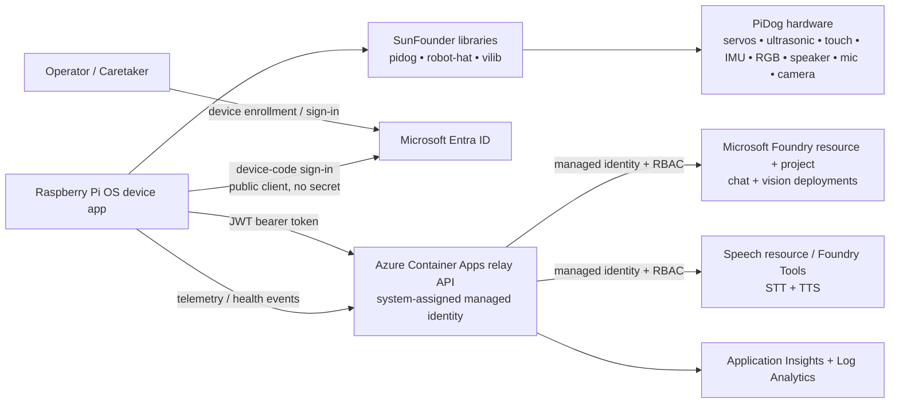

# Sparky Architecture

## Overview

Sparky is an AI-powered robot dog built on the SunFounder PiDog platform. The physical robot runs on Raspberry Pi OS and uses SunFounder’s Python libraries:

- `robot-hat` for low-level board access, audio, GPIO, PWM, I2C, servos, and device utilities
- `pidog` for high-level robot behaviors, motion primitives, sensors, RGB effects, and sound hooks
- `vilib` for camera capture and local vision helpers

Azure provides the cloud intelligence layer:

- chat/reasoning via Microsoft Foundry model deployments
- speech-to-text and text-to-speech via Speech resources integrated with Foundry-era Entra auth patterns
- vision understanding via a multimodal Foundry deployment
- a lightweight relay API in Azure Container Apps so the Pi never calls Azure AI with keys

## Research summary

Based on the current SunFounder docs and repositories:

- PiDog targets **Raspberry Pi OS on Linux** and the vendor packages declare `requires-python >= 3.7`.
- PiDog V2 supports **Raspberry Pi 3/4/5 and Zero 2W**; PiDog V1 does not support Raspberry Pi 5.
- The platform exposes:
  - **12 servos** for legs, head, and tail through the `Pidog` class
  - **camera** access through `vilib`
  - **ultrasonic distance**, **dual touch**, **sound direction**, **IMU**, and **RGB board** sensors/effects
  - **speaker/audio** via Robot HAT and I2S
- A custom application typically imports `Pidog()`, initializes the robot, then composes motion, sensor reads, sounds, and camera/vision flows in Python examples.

## System context



## Keyless authentication design

### Chosen pattern

Sparky uses an **Azure relay service** rather than direct device-to-Foundry calls.

1. The Pi application signs in to a custom API using **Microsoft Entra ID device code flow** as a **public client**.
2. The relay API validates the device/user token.
3. The relay API uses its **system-assigned managed identity** to request tokens for:
   - `https://ai.azure.com/.default` for Microsoft Foundry model inference
   - the Speech resource custom-domain scope for STT/TTS calls
4. RBAC grants the relay only the required `Cognitive Services User` access.

### Why not call Foundry directly from the Pi?

Direct device access would either require:

- an Azure AI API key,
- a long-lived client secret,
- or a more complex certificate lifecycle on the Pi.

The relay adds one network hop but gives the project a secure default with centralized:

- policy enforcement
- observability
- throttling
- prompt/template management
- future multi-dog fleet controls

## Concrete Azure resource list

The baseline deployment should provision:

1. **Microsoft Foundry resource**  
   Top-level Azure AI resource boundary.

2. **Microsoft Foundry project**  
   Project container for runtime configuration and model usage.

3. **Chat model deployment**  
   Baseline reasoning model for command interpretation, personality, and planning.  
   Recommended starting point: a cost-efficient GPT-4.1-class deployment for conversational reasoning.

4. **Vision model deployment**  
   Multimodal deployment used for image/scene understanding from still frames captured on the Pi.  
   Prefer a model that accepts image + text prompts.

5. **Speech resource with custom subdomain**  
   Used for speech-to-text and text-to-speech with Microsoft Entra ID authentication.

6. **Azure Container Apps environment**

7. **Azure Container App: sparky-relay**
   - system-assigned managed identity
   - ingress enabled
   - Entra-protected API surface

8. **Azure Container Registry**
   Stores relay images for code CD.

9. **Application Insights + Log Analytics**
   Cloud telemetry, traces, and diagnostics.

10. **Resource group(s)**
    Separate dev/prod scopes managed by Bicep.

## Repo layout

```text
.
├── src/
│   ├── device/
│   │   ├── sparky_device/      # Pi runtime and hardware adapters
│   │   └── tests/
│   ├── cloud/
│   │   ├── sparky_relay/       # Entra-protected relay API
│   │   └── tests/
│   └── shared/
│       ├── sparky_contracts/   # DTOs, schemas, prompts, config helpers
│       └── tests/
├── infra/
│   ├── modules/
│   ├── environments/
│   │   ├── dev/
│   │   └── prod/
│   └── scripts/
├── docs/
│   ├── adr/
│   └── diagrams/
└── .github/
    └── workflows/
```

## IaC choice

The project should use **Bicep**.

### Justification

- Azure-only scope
- native support for managed identities and RBAC
- simpler bootstrap than Terraform for a greenfield repo
- easy PR validation with `az bicep build` and `what-if`

See [ADR 0002](adr/0002-bicep-for-azure-infrastructure.md).

## CI/CD strategy

Infra and code workflows stay separate.

### Infra workflows

#### `infra-ci.yml`

Trigger:

- pull requests touching `infra/**`
- manual runs

Responsibilities:

- Bicep lint/build validation
- static checks on parameters/modules
- `what-if` against the target environment when credentials are available
- block merges on invalid IaC

#### `infra-cd.yml`

Trigger:

- push to `main` affecting `infra/**`
- manual promotion to higher environments

Responsibilities:

- deploy Bicep to dev
- environment approvals for prod
- publish deployment outputs used by code delivery

### Code workflows

#### `code-ci.yml`

Trigger:

- pull requests touching `src/**`
- pull requests touching `docs/**` when doctest or link-check steps are added

Responsibilities:

- Python formatting/linting
- unit tests for device, cloud, and shared packages
- mocked hardware tests
- API contract tests
- packaging/build checks

#### `code-cd.yml`

Trigger:

- push to `main` affecting `src/**`
- version tags / manual release

Responsibilities:

- build and publish relay container image
- deploy relay to Container Apps
- publish device package/release artifacts for Raspberry Pi installation

## Testing strategy

Every code issue must include tests.

### Device-side testing

GitHub-hosted runners cannot exercise real PiDog hardware, so the device code must depend on **wrapper interfaces**, not vendor classes directly.

Recommended seam design:

- `DogMotionPort` wraps `Pidog`
- `BoardPort` wraps `robot_hat` features such as speaker/GPIO/PWM
- `CameraPort` wraps `vilib`
- `SensorPort` wraps ultrasonic/touch/IMU/sound-direction reads

Unit tests run against fake implementations:

- fake motion adapter captures target poses and actions
- fake camera adapter replays stored test images
- fake audio adapter replays WAV fixtures and captures synthesized output requests
- fake sensor adapter emits scripted events

### Cloud-side testing

- unit tests for relay authentication, policy, and request shaping
- contract tests for request/response schemas
- mocked Azure SDK clients for Foundry and Speech integrations

### Hardware-in-the-loop testing

Not feasible in standard GitHub-hosted CI. Mitigation:

- keep hardware-facing code thin and adapter-based
- define manual or self-hosted Pi smoke tests for milestone acceptance
- record reproducible demo scenarios for final validation

## Non-goals for the planning baseline

- Writing production device code
- Writing production Bicep
- Building a mobile app or web dashboard
- Designing private networking from day one

## Open questions

1. Should the first production release use a self-hosted Raspberry Pi runner for nightly smoke tests?
2. Which exact chat and vision deployments best balance latency vs cost on the target budget?
3. How much offline fallback behavior is required when Azure is unreachable?
4. Will multi-dog fleet enrollment be needed, or is a single-device enrollment flow sufficient?
