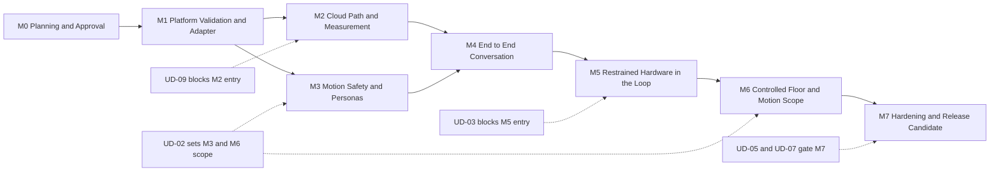
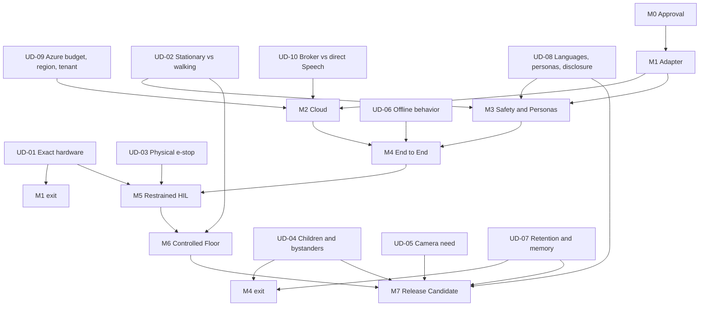
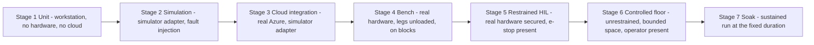

# Sparky — Project Plan

> Phased delivery plan for the persona-driven robotic companion. Companion to [system-architecture.md](system-architecture.md).

| Field | Value |
|-------|-------|
| **Document** | Project Plan |
| **Owner** | Architect (Lead & Software Architect) |
| **Requested by** | Dave Davis |
| **Status** | **DRAFT — AWAITING APPROVAL** |
| **Approval state** | ⚠️ UDs approved; dual approval of both documents still pending |
| **Companion document** | [system-architecture.md](system-architecture.md) — also ⚠️ pending dual approval |
| **Implementation gate** | 🔒 **BLOCKED** |
| **Last updated** | 2026-08-28 |

## 0. Dual Approval Gate

No application or product code may be written until **Dave Davis explicitly approves BOTH**:

1. `docs/architecture/system-architecture.md`, **and**
2. `docs/architecture/project-plan.md` (this document)

| Event | Gate |
|-------|------|
| Approval of this plan alone | 🔒 Blocked |
| Approval of the architecture alone | 🔒 Blocked |
| Silence or lapsed time | 🔒 Blocked |
| Requested revisions | 🔒 Blocked — returns to planning |
| Approval by anyone other than Dave Davis | 🔒 Blocked |
| Explicit approval of **both** by Dave Davis | 🔓 Open — M1 may start, subject to per-milestone entry gates |

Beyond the gate itself, **every milestone has its own entry gate**. Opening the approval gate does not authorize M5 or M6; it authorizes M1. This is deliberate. Dave Davis has now approved all ten user decisions, so the remaining gate is explicit approval of the architecture and project-plan documents themselves.

Nothing in this plan authorizes any modification under `exlibs/`, at any milestone, ever.

---

## 1. Decision Register Reference

The ten user decisions are now approved by Dave Davis. They are defined in [system-architecture.md §4](system-architecture.md#4-user-decision-register-ud-01--ud-10) and remain referenced here as the decisions that govern specific milestone scope and entry conditions.

| ID | Decision | Blocks milestone(s) |
|----|----------|---------------------|
| **UD-01** | Exact hardware | M1 exit, M5 entry |
| **UD-02** | Stationary vs walking v1 | M3 scope, M6 entry |
| **UD-03** | Physical e-stop / cutoff / mute | **M5 entry — hard block** |
| **UD-04** | Children / guests / bystanders | M4 exit, M7 entry |
| **UD-05** | Camera need | M7 entry |
| **UD-06** | Offline behavior | M4 scope |
| **UD-07** | Retention / deletion / memory | M4 exit, M7 entry |
| **UD-08** | Languages / personas / disclosure | M3 scope, M4 exit |
| **UD-09** | Azure budget / regions / tenant / subscription / latency | **M2 entry — hard block** |
| **UD-10** | Broker mandatory vs direct Speech evaluation | M2 scope |

> **Rule:** a milestone whose entry gate references a decision that is still not approved for implementation **does not start**. Work does not "begin provisionally" on a blocked milestone.

---

## 2. Team and Ownership

| Owner | Role | Owns in this plan |
|-------|------|-------------------|
| **Architect** | Lead & Software Architect | Plan integrity, interfaces, persona architecture, ADRs, milestone exit review, readiness recommendation |
| **Robotics** | Embedded Robotics Engineer | Hardware adapter, motion arbiter, safety envelope, `exlibs` runtime validation, HIL rig |
| **Speech** | Audio & Speech Engineer | Audio capture/playback, STT/TTS integration, barge-in, latency measurement, speech-motion sync |
| **AzureAI** | Azure AI Engineer | Broker, identity boundary, model integration, content safety, resilience, cost telemetry |
| **Reliability** | Test & Reliability Engineer | Acceptance criteria, simulator fidelity, test progression, soak, HIL readiness review |
| **Rai** | Responsible AI Reviewer | Safety, privacy, credential, disclosure review; blocker closure |
| **Fact Checker** | Verification & Devil's Advocate | Verification of runtime, SDK, quota, and latency claims as they become measurable |
| **Scribe** | Session Logger & Decision Merger | Decision merge from inbox; session logs |
| **Dave Davis** | Requester | **The ten decisions, and the dual approval gate** |

---

## 3. Phase Overview

| Phase | Name | Primary outcome | Hardware needed | Cloud needed |
|-------|------|-----------------|-----------------|--------------|
| **M0** | Planning and Approval | Both documents approved; decisions resolved | No | No |
| **M1** | Platform Validation and Adapter | Do the libraries actually run, and is the adapter real | Yes, bench only | No |
| **M2** | Cloud Path and Measurement | Broker works; latency and cost are **measured**, not guessed | No | Yes |
| **M3** | Motion Safety and Personas | Arbiter and persona model proven in simulation | No — simulator | No |
| **M4** | End-to-End Conversation | A full turn works, in simulation, with barge-in | No — simulator | Yes |
| **M5** | Restrained HIL | Real servos, restrained, with a real e-stop | Yes, restrained | Yes |
| **M6** | Controlled Floor | Unrestrained motion in a controlled space | Yes, floor | Yes |
| **M7** | Hardening and RC | Soak, cost, privacy, RAI closure | Yes | Yes |

---

## 4. Milestones

### M0 — Planning and Approval

| Field | Value |
|-------|-------|
| **Entry gate** | None. This is where we are. |
| **Owner** | Architect |
| **Depends on** | — |
| **Exit gate** | 🔒 Dave Davis explicitly approves **both** documents |

**Deliverables**

| # | Deliverable | Owner | Status |
|---|-------------|-------|--------|
| M0-D1 | `docs/architecture/system-architecture.md` | Architect | ✅ Delivered, unapproved |
| M0-D2 | `docs/architecture/project-plan.md` | Architect | ✅ Delivered, unapproved |
| M0-D3 | Six ADRs under `docs/architecture/decisions/` | Architect | ✅ Delivered, proposed |
| M0-D4 | Read-only `exlibs` evidence table with citations | Robotics → Architect | ✅ Delivered |
| M0-D5 | Ten-item decision register | Architect | ✅ Delivered; all ten decisions now approved by Dave Davis |
| M0-D6 | Fact Checker verification pass | Fact Checker | ✅ Core claims verified; open items listed |
| M0-D7 | Rai safety/privacy review | Rai | 🟡 Amber, 5 blockers |
| M0-D8 | Reliability test-readiness review | Reliability | ✅ APPROVE WITH CONDITIONS — REL-C1 to REL-C6 confirmed at genuine re-review |
| M0-D9 | Resolution of UD-01 to UD-10 | **Dave Davis** | ✅ **All ten approved** |
| M0-D10 | M0 issue #1 tracking and user-decision owner matrix | Architect | ✅ **Complete** — tracking doc updated and UD issues closed as approved |

**Acceptance criteria**

| ID | Criterion | Evidence |
|----|-----------|----------|
| AC-M0-01 | Every `MUST` requirement in the architecture maps to at least one acceptance criterion in this plan | Traceability matrix, §6 |
| AC-M0-02 | Every consequential recommendation has an ADR | ADR index in README |
| AC-M0-03 | Every claim about `exlibs` carries a file citation | Architecture §5.2 |
| AC-M0-04 | Every unproven claim is labelled ASSUMPTION, EXPERIMENT, or NOT ASSERTED | Architecture §5.3–5.4 |
| AC-M0-05 | All five required Mermaid diagrams are present and render | Architecture §7.2–7.6 |
| AC-M0-06 | Both documents explicitly state the dual approval gate | This §0, architecture §0 |
| AC-M0-07 | Ten decisions are enumerated and cross-referenced from README, architecture, plan, and ADRs | §1 here, architecture §4 |
| AC-M0-08 | **Dave Davis explicitly approves both documents** | ❌ Outstanding |

**Risks:** R-13 (decisions stall the plan). Mitigation is that the decisions are enumerated with named blocking milestones, so the cost of leaving one open is visible rather than diffuse.

---

### M1 — Platform Validation and Hardware Adapter

| Field | Value |
|-------|-------|
| **Entry gate** | 🔒 Dual approval complete. UD-01 strongly recommended, since without confirmed hardware this milestone validates a guess. |
| **Owner** | Robotics, with Architect on interfaces and Reliability on the simulator |
| **Depends on** | M0 |
| **Exit gate** | Runtime compatibility answered with evidence; adapter and simulator both real and interchangeable |

**Purpose.** This milestone exists because [AS-01](system-architecture.md#53-load-bearing-assumptions) is an assumption, not a fact. Raspberry Pi OS Bookworm 64-bit with Python 3.11 is an **initial validation target**. The supplied libraries declare `>=3.7` and Linux-only, declare no dependencies, and were not observed running (EV-19, EV-20). We find out here, first, before anything is built on top.

**Deliverables**

| # | Deliverable | Owner |
|---|-------------|-------|
| M1-D1 | Runtime compatibility report: does `pidog 1.3.13` + `robot-hat 2.3.6` import and drive servos on the target image | Robotics |
| M1-D2 | Resolution of OQ-01: pin robot-hat to `2.3.6` or `2.5.x`, with reasoning and evidence | Robotics |
| M1-D3 | The true transitive dependency set, pinned, since packaging metadata declares none (EV-19, EV-20) | Robotics |
| M1-D4 | `HardwareAdapter` interface definition | Architect |
| M1-D5 | `PiAdapter` implementation wrapping `exlibs/pidog` | Robotics |
| M1-D6 | `SimulatorAdapter` implementation — first-class, not a stub (REL-C2) | Reliability |
| M1-D7 | CI import guard: no module outside the adapter imports `pidog`, `robot_hat`, or `vilib` (HA-01) | Robotics |
| M1-D8 | CI ban check: `pidog.llm`, `pidog.stt`, `pidog.tts`, `pidog.voice_assistant` are never imported (HA-03, EV-07) | Robotics |
| M1-D9 | Runtime assertion: nothing is listening on port 9000 (HA-04, EV-08) | Robotics |
| M1-D10 | Bench test rig — device on blocks, legs unloaded, no floor contact | Robotics |
| M1-D11 | Lint, format, and type-check CI gates | Architect |

**Acceptance criteria**

| ID | Criterion | Evidence | Verifies |
|----|-----------|----------|----------|
| AC-HAL-01 | `PiAdapter` and `SimulatorAdapter` are substitutable with no caller change; the full core test suite passes against both | CI run, both adapters | NFR-05 |
| AC-HAL-02 | The adapter exposes only semantic operations; no joint-angle API is reachable by callers | Interface review + API surface test | HA-02 |
| AC-HAL-03 | CI fails if any module outside the adapter imports `pidog`, `robot_hat`, or `vilib` | Deliberate violation commit fails CI | HA-01 |
| AC-HAL-04 | CI fails if the banned PiDog AI wrapper modules are imported | Deliberate violation fails CI | HA-03 |
| AC-HAL-05 | Adapter clamps leg and tail commands beyond `exlibs` behaviour | Unit test with out-of-range command | HA-06, EV-13 |
| AC-HAL-06 | Adapter refuses to arm if underlying library versions differ from the pinned validated set | Version-mismatch test | HA-07 |
| AC-TEST-01 | Core logic tests run on a developer workstation with no Pi and no Azure account | CI run on non-Pi runner | NFR-06 |
| AC-TEST-02 | Lint, format, and type-check gates pass and are enforced | CI run | NFR-07 |
| AC-PRIV-03 | No process listens on port 9000 at any point during a full run | Port scan during integration test | PR-04, EV-08 |
| AC-M1-01 | The runtime compatibility question is **answered with evidence**, whichever way it goes | M1-D1 report | AS-01 |

**Test progression:** unit tests against the simulator; bench-only hardware smoke test with legs unloaded and the device on blocks. **No floor contact at M1.**

**Risks:** R-01, R-02, R-03. If M1-D1 comes back negative, the plan stops and returns to M0 for a platform decision. That is an acceptable and expected outcome of a validation milestone, and it is far cheaper here than at M5.

---

### M2 — Cloud Path and Measurement

| Field | Value |
|-------|-------|
| **Entry gate** | 🔒 **UD-09 must be resolved.** No Azure subscription, region, tenant, or budget means no provisioning. This is a hard block. Also requires M1 exit. |
| **Owner** | AzureAI, with Speech on audio latency |
| **Depends on** | M0, M1, UD-09 |
| **Exit gate** | Broker works end-to-end; latency and cost are **measured** and a target is set from measurement |

**Purpose.** Everything the architecture refuses to assert about Azure — latency, quota, SDK, model availability, cost ([NA-01 to NA-05](system-architecture.md#54-deliberately-not-asserted)) — becomes a measured number here. This milestone does not accept vendor claims as evidence.

**Deliverables**

| # | Deliverable | Owner |
|---|-------------|-------|
| M2-D1 | Sparky Azure Broker: mTLS ingress, managed identity egress ([ADR-0004](decisions/ADR-0004-azure-broker-identity-boundary.md)) | AzureAI |
| M2-D2 | Per-device X.509 enrolment and revocation procedure | AzureAI |
| M2-D3 | Broker Client on device — the only Azure-facing component | AzureAI |
| M2-D4 | STT and TTS integration through the broker | Speech |
| M2-D5 | Model integration with dual content-safety checkpoints | AzureAI |
| M2-D6 | Resolution of OQ-03 (audio stack) and OQ-04 (streaming vs batch synthesis) | Speech |
| M2-D7 | **Measured** per-stage latency distribution from the target device on the target network | Speech + AzureAI |
| M2-D8 | **Measured** per-turn cost model, attributed by subsystem | AzureAI |
| M2-D9 | Verified SDK versions, API versions, model identity, and regional availability | AzureAI + Fact Checker |
| M2-D10 | Resilience layer: timeouts, bounded retry, circuit breaker, late-response discard | AzureAI |
| M2-D11 | 🧪 Direct-Speech short-lived-token experiment — **only if UD-10 authorizes it** | AzureAI |

**Acceptance criteria**

| ID | Criterion | Evidence | Verifies |
|----|-----------|----------|----------|
| AC-AI-01 | A persona-conditioned request produces a model reply through the broker | Integration test | FR-03 |
| AC-AUD-02 | Captured audio produces an accurate transcript via Azure Speech | Integration test with reference phrases | FR-02 |
| AC-AUD-03 | A reply is synthesized in the persona's configured voice | Integration test | FR-04 |
| AC-SEC-01 | The device filesystem contains no long-lived cloud credential; only the device certificate | Filesystem audit + secret scan | PR-08 |
| AC-SEC-02 | Revoking one device certificate blocks that device and no other | Revocation test with two enrolled devices | PR-09 |
| AC-SEC-03 | The device cannot reach the model or Speech endpoints directly | Network egress test from device | ADR-0004 |
| AC-RAI-02 | Content safety runs on both input and output; a blocked item yields a persona-voiced refusal, not silence or a raw error | Safety test corpus | PR-06 |
| AC-COST-01 | Cost per turn is measurable and attributable to STT, model, TTS, and safety | Broker cost telemetry | NFR-04 |
| AC-CLOUD-01 | Every cloud call has an explicit timeout; no unbounded wait exists in the turn path | Code review + fault-injection test | §9.3 |
| AC-CLOUD-02 | A late response for an invalidated generation is discarded and never spoken | Fault-injection test | R-09 |
| AC-M2-01 | An NFR-01 latency target is **set from M2-D7 measurement** and recorded | Measurement report | NFR-01 |
| AC-M2-02 | No latency, quota, or cost figure in any project document is unsourced | Document audit | NA-01 to NA-05 |

**Test progression:** integration tests against real Azure services from the target device on the target network. Not from a developer laptop — the network path is part of what is being measured.

**Risks:** R-04, R-05, R-11. UD-10 governs whether M2-D11 exists at all; the default is that it does not.

---

### M3 — Motion Safety and Persona Model

| Field | Value |
|-------|-------|
| **Entry gate** | M1 exit. **UD-02 sets scope** — stationary-only is assumed; walking expands this milestone substantially. |
| **Owner** | Robotics on the arbiter, Architect on personas |
| **Depends on** | M0, M1 |
| **Exit gate** | Every safety mechanism demonstrated in simulation; persona model complete and fail-closed |

**Purpose.** Build the safety machinery that `exlibs` does not provide — no TTL, no cancellation, no watchdog, no startup inhibit, no single authority (EV-13, EV-14, EV-15) — and prove it in simulation where failure is free.

**Deliverables**

| # | Deliverable | Owner |
|---|-------------|-------|
| M3-D1 | Motion Arbiter: single actuator authority, semantic commands, TTL, cancellation, priority ([ADR-0002](decisions/ADR-0002-deterministic-motion-arbiter.md)) | Robotics |
| M3-D2 | Motion watchdog | Robotics |
| M3-D3 | Startup inhibit and explicit arming with self-test | Robotics |
| M3-D4 | Safe-pose definition and unwind routine; resolves OQ-02 | Robotics |
| M3-D5 | Static gesture allowlist derived from `preset_actions` (EV-18) | Robotics |
| M3-D6 | Gesture Validator at L3 | Architect |
| M3-D7 | Persona bundle schema and validator; resolves OQ-06 ([ADR-0003](decisions/ADR-0003-immutable-versioned-personas.md)) | Architect |
| M3-D8 | Persona Registry with immutable load and versioning | Architect |
| M3-D9 | Minimal safe persona built in | Architect |
| M3-D10 | Starter persona bundles — count and locale set by UD-08 | Architect |
| M3-D11 | Turn state machine implementing the state diagram | Architect |
| M3-D12 | Simulation harness for full motion sequences with fault injection | Reliability |

**Acceptance criteria**

| ID | Criterion | Evidence | Verifies |
|----|-----------|----------|----------|
| AC-MOT-01 | A free-form joint-angle command originating from any AI path is rejected; only allowlisted semantic commands execute | Adversarial test with crafted model output | FR-14, SR-06 |
| AC-MOT-02 | A gesture not in the active persona's vocabulary is rejected, telemetry is emitted, and the device still speaks the reply | Simulation test | FR-05, §7.4 |
| AC-SAF-02 | The arbiter refuses all commands before arming; motion is impossible at startup | Simulation test | SR-02 |
| AC-SAF-03 | A command whose TTL expires is dropped and counted, never executed late | Simulation test with induced delay | SR-03 |
| AC-SAF-04 | Failing to service the arbiter within the bound drives the safe pose and latches | Fault-injection test | SR-04 |
| AC-SAF-05 | Static analysis proves exactly one component writes actuators | Import/call-graph check in CI | SR-05 |
| AC-SAF-06 | An unhandled exception in the motion path drives the safe pose and latches | Fault-injection test | SR-07 |
| AC-SAF-07 | The safe pose is reachable from every commanded pose without simulated topple | Exhaustive simulation over the pose set | SR-08, AS-07 |
| AC-PER-01 | A new persona is added by dropping a bundle, with zero core code change | Add-a-persona test | FR-07 |
| AC-PER-02 | Persona switch takes effect at the next turn boundary and never mid-turn | State machine test | FR-06 |
| AC-PER-03 | An invalid bundle is rejected at load and never becomes active | Malformed-bundle corpus | §8.3 |
| AC-PER-04 | A bundle requesting an unsupported gesture or ungranted permission is rejected at load, not at runtime | Capability test | §8.3, R-10 |
| AC-PER-05 | If the default persona fails to load, the minimal safe persona activates and the device remains honest and motion-restricted | Failure-injection test | §8.3 |
| AC-PER-06 | Persona objects are immutable after load | Mutation attempt test | §8.2 |
| AC-STATE-01 | Every transition in the state diagram is exercised; no undefined transition exists | State machine coverage test | §7.6 |
| AC-STATE-02 | `EStopped` is reachable from every operational state and is not exitable by software | State machine test | SR-01, ST-02 |
| AC-UX-01 | The state indicator distinguishes idle, listening, thinking, speaking, degraded, safe-stop | Simulation + LED adapter test | FR-10 |

**Test progression:** simulation only. **No hardware at M3.** This is intentional: a safety mechanism that has not been proven in simulation has no business being tested against real servos.

**Risks:** R-06, R-08, R-10, R-14.

---

### M4 — End-to-End Conversation in Simulation

| Field | Value |
|-------|-------|
| **Entry gate** | M2 and M3 exit. **UD-06 sets degraded-mode scope.** |
| **Owner** | Architect integrating; Speech on barge-in; AzureAI on degradation |
| **Depends on** | M2, M3 |
| **Exit gate** | A complete turn works with barge-in and degraded mode, entirely in simulation |

**Purpose.** Wire the cloud path (M2) to the safety and persona machinery (M3) and prove the whole loop before a single real servo moves.

**Deliverables**

| # | Deliverable | Owner |
|---|-------------|-------|
| M4-D1 | Session manager and generation-ID lifecycle | Architect |
| M4-D2 | Full turn orchestration per the data-flow diagram | Architect |
| M4-D3 | Barge-in: speech and linked motion cancelled by generation ID ([ADR-0006](decisions/ADR-0006-push-to-talk-half-duplex.md)) | Speech |
| M4-D4 | Degraded-mode controller with honest user-facing messaging | AzureAI |
| M4-D5 | Local canned-response set — scope set by UD-06 | Architect |
| M4-D6 | Disclosure policy component, above persona prompts — wording set by UD-08 | Architect + Rai |
| M4-D7 | Telemetry emitter with the exclusion list enforced | AzureAI |
| M4-D8 | Shutdown sequence per §11.4 | Robotics |
| M4-D9 | Soak duration fixed; resolves OQ-07 (REL-C5) | Reliability |

**Acceptance criteria**

| ID | Criterion | Evidence | Verifies |
|----|-----------|----------|----------|
| AC-AUD-01 | Capture starts only on an explicit user trigger; the mic is never open outside `Listening` | State + audio device test | FR-01, ST-06 |
| AC-AUD-04 | A complete turn runs end to end in simulation: trigger, STT, safety, model, safety, validate, TTS, motion, idle | Integration test | FR-01–FR-05 |
| AC-AUD-05 | Barge-in stops playback **and** cancels the linked motion generation; motion unwinds to neutral | Integration test with induced barge-in | FR-08, NFR-02 |
| AC-AUD-06 | An NFR-02 barge-in stop-latency target is set from measurement | Measurement report | NFR-02 |
| AC-REL-03 | With the network severed, the device enters `Degraded`, states its status, and stays responsive to physical controls | Network fault injection | FR-09, ST-04 |
| AC-REL-04 | Canned responses serve while degraded, and the device never fabricates an answer | Degraded-path test | FR-11 |
| AC-REL-06 | Connectivity restoration returns the device to `Idle` without a restart | Fault injection | §7.6 |
| AC-RAI-01 | The device discloses it is an AI on session start and on request; no persona prompt can suppress it | Adversarial persona test | FR-12, PR-07 |
| AC-PRIV-01 | After a full session, no audio file and no transcript exists on disk | Filesystem diff across a session | PR-01, PR-02 |
| AC-PRIV-04 | Default-level logs contain no transcript, audio, or credential | Log audit against a known-phrase session | PR-05 |
| AC-SHUT-01 | Shutdown cancels the generation, reaches the safe pose, inhibits, and exits — including on `SIGTERM` and on unhandled exception | Shutdown test matrix | §11.4, SR-07 |
| AC-OBS-01 | Every turn emits a structured event with generation ID, `persona_id@version`, and per-stage durations | Telemetry test | §13.1 |

**Test progression:** integration testing against the simulator adapter with real Azure services. Full fault injection: network loss, slow responses, late responses, safety blocks, malformed model output, adapter faults.

**Risks:** R-04, R-09, R-15.

**Exit blockers:** UD-04 and UD-07 must be resolved before M4 is signed off, because the disclosure model (M4-D6) and the no-retention posture (AC-PRIV-01) cannot be finalized without them.

---

### M5 — Restrained Hardware-in-the-Loop

| Field | Value |
|-------|-------|
| **Entry gate** | 🔒 **HARD BLOCK.** All of: M4 exit; **UD-01 resolved** (confirmed hardware); **UD-03 resolved and the physical e-stop present, wired, and tested**; Rai blocker RAI-B1 closed. |
| **Owner** | Robotics on the rig, Reliability on the protocol |
| **Depends on** | M4, UD-01, UD-03 |
| **Exit gate** | Every safety mechanism verified on real hardware, restrained |

**Purpose.** The first time real servos move under the real system. Restrained means the device is physically secured — on blocks, or tethered, with legs unable to bear weight or propel the chassis. Nothing here relies on simulation fidelity; this is where AS-08's limits show up.

**Deliverables**

| # | Deliverable | Owner |
|---|-------------|-------|
| M5-D1 | Restrained HIL rig with the device secured and the e-stop in reach of the operator | Robotics |
| M5-D2 | HIL test protocol with an explicit abort procedure | Reliability |
| M5-D3 | Hardware verification of every M3 safety mechanism (REL-C4) | Reliability |
| M5-D4 | Battery-voltage motion gate calibrated against real readings (AS-09) | Robotics |
| M5-D5 | Speech-motion synchronization tuning on real hardware | Speech + Robotics |
| M5-D6 | Real-hardware latency measurement, compared against M2 simulation figures | Speech |
| M5-D7 | Thermal and power observations under sustained motion | Robotics |

**Acceptance criteria**

| ID | Criterion | Evidence | Verifies |
|----|-----------|----------|----------|
| AC-SAF-01 | Asserting the physical e-stop cuts motion regardless of software state, including with the process deliberately hung; software cannot clear it | HIL test, including a hung-process case | SR-01, ST-02 |
| AC-SAF-04-HW | Watchdog expiry on real hardware drives the safe pose and latches | HIL fault injection | SR-04, REL-C4 |
| AC-SAF-06-HW | Unhandled motion-path exception on real hardware drives the safe pose and latches | HIL fault injection | SR-07, REL-C4 |
| AC-SAF-07-HW | The safe pose is reached from every commanded pose on real hardware without instability | HIL sweep | SR-08, REL-C4 |
| AC-SAF-08 | Battery below threshold inhibits walking-class motion | HIL test at reduced supply | SR-09 |
| AC-HIL-01 | Every M3 acceptance criterion that has a hardware analogue passes on hardware | HIL matrix | REL-C4 |
| AC-HIL-02 | Measured real-hardware latency is recorded and any divergence from M2 is explained | Measurement report | NFR-01 |
| AC-HIL-03 | Watchdog trips and e-stop assertions during M5 each receive a root-cause analysis; none are tuned away | Defect log | REL-C6 |

**Test progression:** restrained HIL only. **No floor contact, no unrestrained motion, no walking at M5.**

**Risks:** R-06, R-07, R-08. R-07 is structurally prevented: without UD-03 and a physical e-stop, this milestone does not start.

---

### M6 — Controlled Floor and Motion Scope

| Field | Value |
|-------|-------|
| **Entry gate** | M5 exit with all safety criteria passed. **UD-02 determines scope.** Under the stationary-first assumption this milestone is small; if walking is chosen for v1, it is large and the M3 safety envelope must be revisited first. |
| **Owner** | Robotics, with Reliability |
| **Depends on** | M5, UD-02 |
| **Exit gate** | Motion within the chosen scope is stable and safe in a controlled space |

**Deliverables**

| # | Deliverable | Owner |
|---|-------------|-------|
| M6-D1 | Controlled test space: bounded floor area, clear of people and obstacles, operator with e-stop | Reliability |
| M6-D2 | Unrestrained validation of the stationary motion vocabulary | Robotics |
| M6-D3 | **If UD-02 selects walking:** expanded safety envelope, gait stability analysis, topple analysis, floor-surface characterization | Robotics |
| M6-D4 | Ultrasonic-based proximity inhibit for motion near obstacles | Robotics |
| M6-D5 | Resolution of OQ-08 — is the sound-direction sensor worth its integration cost | Robotics + Speech |
| M6-D6 | Full expressive-behaviour pass with the shipping personas | Architect |

**Acceptance criteria**

| ID | Criterion | Evidence | Verifies |
|----|-----------|----------|----------|
| AC-FLOOR-01 | Every gesture in the shipping vocabulary executes unrestrained without topple or self-collision | Controlled-floor sweep | SR-08 |
| AC-FLOOR-02 | The e-stop remains effective during unrestrained motion | Floor test | SR-01 |
| AC-FLOOR-03 | Proximity inhibit stops motion before contact with a detected obstacle | Floor test with an obstacle | R-06 |
| AC-FLOOR-04 | **Walking only:** gait is stable over a defined distance on the characterized surface with no topple | Floor test | NA-07, UD-02 |
| AC-FLOOR-05 | Persona motion vocabularies contain only gestures validated at AC-FLOOR-01 | Vocabulary audit | §8.1 |

**Test progression:** controlled-floor testing, operator present, e-stop in hand, no bystanders.

**Risks:** R-06, R-14, plus NA-07 if walking is selected.

---

### M7 — Hardening and Release Candidate

| Field | Value |
|-------|-------|
| **Entry gate** | M6 exit. **UD-04, UD-05, UD-07, UD-08 must all be resolved.** Rai blockers RAI-B2, RAI-B3, RAI-B4, RAI-B5 must be closed. |
| **Owner** | Reliability, with Rai on closure and AzureAI on cost |
| **Depends on** | M6, UD-04, UD-05, UD-07, UD-08 |
| **Exit gate** | Soak passed, all Rai blockers closed, cost within budget, readiness checklist complete |

**Deliverables**

| # | Deliverable | Owner |
|---|-------------|-------|
| M7-D1 | Soak test at the M4-D9 duration | Reliability |
| M7-D2 | Rai blocker closure evidence for RAI-B1 to RAI-B5 | Rai |
| M7-D3 | Privacy verification: no audio, no transcripts, no port 9000, no camera | Rai + Reliability |
| M7-D4 | Cost report against the UD-09 budget | AzureAI |
| M7-D5 | Final disclosure copy and locale/persona set per UD-08 | Architect + Rai |
| M7-D6 | Retention/deletion policy implementation **or** a recorded decision that no retention exists, per UD-07 | Architect + Rai |
| M7-D7 | Operator documentation: arming, e-stop reset, degraded mode, shutdown | Architect |
| M7-D8 | Final Fact Checker pass on all runtime, SDK, quota, and latency claims now that they are measurable | Fact Checker |
| M7-D9 | Legal review of the GPLv3 position (§6.3, R-12) | Architect to route |

**Acceptance criteria**

| ID | Criterion | Evidence | Verifies |
|----|-----------|----------|----------|
| AC-REL-05 | The device runs the soak duration with no unrecovered failure and no unexplained watchdog trip | Soak report | NFR-03 |
| AC-PRIV-02 | The camera is disabled by default and requires explicit configuration; with default config the camera hardware is never initialized | Config + runtime audit | FR-13, PR-03 |
| AC-PRIV-05 | Across the full soak, no audio, transcript, or credential is written to disk | Filesystem audit | PR-01, PR-02, PR-08 |
| AC-COST-02 | Measured cost per turn is within the UD-09 budget, or the variance is explained and accepted | Cost report | NFR-04 |
| AC-RAI-03 | All five Rai blockers are closed with evidence, or explicitly accepted in writing by Dave Davis | Rai sign-off | §12.2 |
| AC-RC-01 | Every `MUST` requirement has a passing acceptance criterion | Traceability matrix, §6 | AC-M0-01 |
| AC-RC-02 | Every claim previously labelled ASSUMPTION is now VERIFIED or explicitly re-labelled | Document audit | §5.3 |
| AC-RC-03 | The implementation-readiness checklist in architecture §15.1 is fully green | Checklist review | §15.1 |

**Risks:** R-05, R-12, R-15.

---

## 5. Dependencies

### Critical path

`M0 → M1 → M3 → M4 → M5 → M6 → M7`, with M2 parallel to M3 after M1.

The two decisions on the critical path that hurt most if delayed:

- **UD-09** blocks M2 entry outright. M2 is parallel work, so a delay here does not stall M1 or M3 — but it does stall M4, which needs both.
- **UD-03** blocks M5 entry outright. This is the single most expensive decision to leave open, because M1–M4 can all complete without it and then the project sits still.

---

## 6. Requirements Traceability Matrix

Satisfies REL-C3 and AC-M0-01: every `MUST` requirement maps to at least one acceptance criterion.

| Requirement | Acceptance criteria | Milestone |
|-------------|--------------------|-----------|
| FR-01 | AC-AUD-01 | M4 |
| FR-02 | AC-AUD-02 | M2 |
| FR-03 | AC-AI-01 | M2 |
| FR-04 | AC-AUD-03 | M2 |
| FR-05 | AC-MOT-02 | M3 |
| FR-06 | AC-PER-02 | M3 |
| FR-07 | AC-PER-01 | M3 |
| FR-08 | AC-AUD-05 | M4 |
| FR-09 | AC-REL-03 | M4 |
| FR-10 | AC-UX-01 | M3 |
| FR-11 | AC-REL-04 | M4 |
| FR-12 | AC-RAI-01 | M4 |
| FR-13 | AC-PRIV-02 | M7 |
| FR-14 | AC-MOT-01 | M3 |
| SR-01 | AC-SAF-01, AC-STATE-02, AC-FLOOR-02 | M3 sim, M5 HW, M6 floor |
| SR-02 | AC-SAF-02 | M3 |
| SR-03 | AC-SAF-03 | M3 |
| SR-04 | AC-SAF-04, AC-SAF-04-HW | M3, M5 |
| SR-05 | AC-SAF-05 | M3 |
| SR-06 | AC-MOT-01 | M3 |
| SR-07 | AC-SAF-06, AC-SAF-06-HW | M3, M5 |
| SR-08 | AC-SAF-07, AC-SAF-07-HW, AC-FLOOR-01 | M3, M5, M6 |
| SR-09 | AC-SAF-08 | M5 |
| SR-10 | M5 entry gate | Blocked by UD-03 |
| PR-01 | AC-PRIV-01, AC-PRIV-05 | M4, M7 |
| PR-02 | AC-PRIV-01, AC-PRIV-05 | M4, M7 |
| PR-03 | AC-PRIV-02 | M7 |
| PR-04 | AC-PRIV-03 | M1 |
| PR-05 | AC-PRIV-04 | M4 |
| PR-06 | AC-RAI-02 | M2 |
| PR-07 | AC-RAI-01 | M4 |
| PR-08 | AC-SEC-01, AC-PRIV-05 | M2, M7 |
| PR-09 | AC-SEC-02 | M2 |
| PR-10 | M7 entry gate | Blocked by UD-07 |
| NFR-01 | AC-M2-01, AC-HIL-02 | M2, M5 |
| NFR-02 | AC-AUD-05, AC-AUD-06 | M4 |
| NFR-03 | AC-REL-05 | M7 |
| NFR-04 | AC-COST-01, AC-COST-02 | M2, M7 |
| NFR-05 | AC-HAL-01 | M1 |
| NFR-06 | AC-TEST-01 | M1 |
| NFR-07 | AC-TEST-02 | M1 |

---

## 7. Test and HIL Progression

Reliability's condition REL-C1: **simulation → restrained HIL → controlled floor.** No stage may be skipped, and no stage may begin before the previous one passes.

| Stage | Milestone | Hardware | Cloud | Gate to next stage |
|-------|-----------|----------|-------|--------------------|
| 1 Unit | M1, M3 | None | None | Core suite green on both adapters |
| 2 Simulation | M3, M4 | Simulator adapter | None | All M3 safety criteria pass |
| 3 Cloud integration | M2, M4 | Simulator adapter | Real | All M2 and M4 criteria pass |
| 4 Bench | M1 | Real, unloaded, on blocks | None | Servos respond, no unexpected motion |
| 5 Restrained HIL | M5 | Real, secured | Real | **E-stop present and verified (UD-03)** |
| 6 Controlled floor | M6 | Real, unrestrained | Real | All M5 safety criteria pass on hardware |
| 7 Soak | M7 | Real | Real | All M6 criteria pass |

**Non-negotiable rules:**

| ID | Rule |
|----|------|
| TP-01 | No hardware stage begins before the corresponding simulation criteria pass (REL-C1). |
| TP-02 | No restrained-HIL or later stage begins without a verified physical e-stop (UD-03, RAI-B1). |
| TP-03 | Safety requirements are verified in simulation **and** on hardware; simulation alone is insufficient (REL-C4). |
| TP-04 | A watchdog trip or e-stop assertion is a defect with a root cause, never a tuning parameter (REL-C6). |
| TP-05 | No bystanders — and specifically no children — are present at any test stage under the approved UD-04 posture. |
| TP-06 | The simulator is maintained as a first-class artifact for the life of the project, not abandoned after M5 (REL-C2). |

---

## 8. Evidence and Verification Status

### 8.1 Fact Checker position

Core claims are **verified** against the repository with file citations, listed in [system-architecture.md §5.2](system-architecture.md#52-verified-facts-from-read-only-exlibs-assessment) as EV-01 through EV-21. Specifically verified: library versions, the documented `2.5.x` robot-hat requirement, the missing `robot_hat.llm` / `stt` / `voice_assistant` modules, the unauthenticated Vilib service on `0.0.0.0:9000`, the servo topology, the asymmetric head-vs-leg clamping, and the threading model.

**Explicitly not verified and remaining as validation items:**

| Item | Where it resolves |
|------|-------------------|
| Runtime compatibility on Bookworm 64-bit / Python 3.11 | M1-D1 |
| Azure SDK versions, API versions, and model identity | M2-D9 |
| Azure quotas, throughput, and rate limits | M2, gated by UD-09 |
| End-to-end latency from the target device and network | M2-D7, re-measured at M5-D6 |
| Cost per interaction | M2-D8, M7-D4 |
| Regional availability of required services | M2-D9 |

The plan is constructed so that none of these is assumed. Each has a milestone whose job is to produce the number.

### 8.2 Rai position

**🟡 AMBER.** Approved to plan, **not approved to implement**. Five blockers, detailed in [system-architecture.md §12.2](system-architecture.md#122-rai-status):

| Blocker | Closes at | Depends on |
|---------|-----------|------------|
| RAI-B1 — no specified physical e-stop | M5 entry | UD-03 |
| RAI-B2 — undefined bystander/child model | M7 | UD-04 |
| RAI-B3 — undefined retention/deletion policy | M7 | UD-07 |
| RAI-B4 — Vilib unauthenticated service in the dependency tree | M1 mitigation, M7 closure | UD-05, ADR-0005 |
| RAI-B5 — unratified device credential model | M2 | UD-10, ADR-0004 |

Three of the five are user decisions. Engineering cannot close them.

### 8.3 Reliability position

**✅ APPROVE WITH CONDITIONS.** Reliability's initial pass rejected the package for unsupported, pre-asserted reviewer provenance (a provenance-integrity defect), while separately finding the underlying technical test-readiness content sound on the merits. That provenance defect was corrected, and a genuine Reliability re-review of the corrected package has now confirmed the approval, subject to conditions REL-C1 through REL-C6 below, which remain embedded in this plan:

| Condition | Where honoured |
|-----------|----------------|
| REL-C1 — sim before restrained HIL before floor | §7 stage progression, TP-01 |
| REL-C2 — simulator is first-class in M1 | M1-D6, TP-06 |
| REL-C3 — every MUST maps to an acceptance criterion | §6 traceability matrix |
| REL-C4 — safety verified in sim **and** on hardware | M5-D3, TP-03 |
| REL-C5 — soak duration fixed before M4 exit | M4-D9 |
| REL-C6 — watchdog trips and e-stops are defects | AC-HIL-03, TP-04 |

---

## 9. Risk Register — Plan Level

Architecture risks R-01 to R-15 are in [system-architecture.md §14](system-architecture.md#14-risks). These are risks to the **plan** rather than the system.

| ID | Risk | Impact | Mitigation |
|----|------|--------|------------|
| PR-R1 | The dual approval gate is never closed and the project sits in M0 | Total stall | Decisions and gate stated plainly in both documents and the README; nothing is ambiguous about what is needed |
| PR-R2 | UD-03 stays open, M1–M4 complete, and the project stalls at the M5 wall | High — wasted momentum | UD-03 is flagged as the most expensive open decision (§5 critical path) |
| PR-R3 | UD-09 stays open and M2 never starts, blocking M4 | High | M2's hard entry gate makes the cost visible immediately rather than at M4 |
| PR-R4 | M1 finds the libraries do not run on the target image | High — replans the platform | M1 is deliberately first and cheap; the adapter localizes the damage |
| PR-R5 | Pressure to skip a test stage to reach hardware sooner | **Severe** — safety | TP-01 to TP-03 are non-negotiable; Reliability owns the gate, not the delivery pressure |
| PR-R6 | Scope creeps to walking, camera, or wake-word mid-plan | High | M6/M7 gating; explicit non-goals; UD-02 and UD-05 are decisions, not defaults to drift into |
| PR-R7 | Approval is given without resolving the ten decisions, and milestones silently begin blocked | Medium | Per-milestone entry gates block independently of the approval gate |
| PR-R8 | Someone modifies `exlibs` to work around a compatibility problem | High — violates a hard constraint | Stated in both documents and all six ADRs; CI import guards make the boundary observable |

---

## 10. Definition of Done

### Per milestone

A milestone is done when: every deliverable exists, every acceptance criterion has passing evidence, every referenced open question is resolved, Architect has reviewed for coherence, Reliability has confirmed test evidence, and Rai has reviewed any milestone touching safety, privacy, or credentials.

### Per release candidate

M7 exit, all Rai blockers closed or explicitly accepted in writing by Dave Davis, the readiness checklist in [architecture §15.1](system-architecture.md#151-readiness-checklist) fully green, and no requirement left with an unverified assumption in place of evidence.

---

## 11. Cross-References

| Topic | Where |
|-------|-------|
| Package index and approval status | [README.md](README.md) |
| Architecture, diagrams, requirements | [system-architecture.md](system-architecture.md) |
| Ten approved decisions | [system-architecture.md §4](system-architecture.md#4-user-decision-register-ud-01--ud-10) and §1 here |
| ADR-0001 Pi-local hardware adapter | [decisions/ADR-0001-pi-local-hardware-adapter.md](decisions/ADR-0001-pi-local-hardware-adapter.md) |
| ADR-0002 Deterministic motion arbiter | [decisions/ADR-0002-deterministic-motion-arbiter.md](decisions/ADR-0002-deterministic-motion-arbiter.md) |
| ADR-0003 Immutable versioned personas | [decisions/ADR-0003-immutable-versioned-personas.md](decisions/ADR-0003-immutable-versioned-personas.md) |
| ADR-0004 Azure broker and identity boundary | [decisions/ADR-0004-azure-broker-identity-boundary.md](decisions/ADR-0004-azure-broker-identity-boundary.md) |
| ADR-0005 Privacy defaults and camera disabled | [decisions/ADR-0005-privacy-defaults-camera-disabled.md](decisions/ADR-0005-privacy-defaults-camera-disabled.md) |
| ADR-0006 Push-to-talk half-duplex | [decisions/ADR-0006-push-to-talk-half-duplex.md](decisions/ADR-0006-push-to-talk-half-duplex.md) |

---

**Status: DRAFT — AWAITING APPROVAL. Implementation is BLOCKED until Dave Davis explicitly approves BOTH `system-architecture.md` AND this document.**
