# Sparky — System Architecture

> Persona-driven robotic companion on PiDog-class Raspberry Pi hardware with Azure-hosted AI and Azure Speech.

| Field | Value |
|-------|-------|
| **Document** | System Architecture |
| **Owner** | Architect (Lead & Software Architect) |
| **Requested by** | Dave Davis |
| **Status** | **DRAFT — AWAITING APPROVAL** |
| **Approval state** | ❌ Not approved |
| **Companion document** | [project-plan.md](project-plan.md) — also ❌ not approved |
| **Implementation gate** | 🔒 **BLOCKED** |
| **Last updated** | 2026-08-28 |

## 0. Approval Gate — Read First

Implementation of application/product code is **BLOCKED** and remains blocked until **Dave Davis explicitly approves BOTH**:

1. `docs/architecture/system-architecture.md` (this document), **and**
2. `docs/architecture/project-plan.md`

Explicitly, the gate does **not** open on any of the following:

| Event | Gate result |
|-------|-------------|
| Approval of this document alone | 🔒 Still blocked |
| Approval of `project-plan.md` alone | 🔒 Still blocked |
| Silence, no response, or lapsed time | 🔒 Still blocked |
| "Looks good, but change X" / requested revisions | 🔒 Still blocked — returns to planning |
| Approval by anyone other than Dave Davis | 🔒 Still blocked |
| Explicit approval of **both** documents by Dave Davis | 🔓 Open, subject to milestone entry gates in the project plan |

In addition, ten user decisions listed in [§4, Decision Register](#4-unresolved-user-decision-register-ud-01--ud-10) are unresolved. Several of them materially change this architecture. Approval given without resolving them is accepted at the user's discretion, but the affected milestones in the project plan carry explicit entry gates that cannot be satisfied until the corresponding decision is made.

This document does not authorize, and must not be read as authorizing, any change to files under `exlibs/`. That tree is read-only evidence.

---

## 1. Goals and Non-Goals

### 1.1 Product goal

A physically embodied, persona-driven conversational companion. A person speaks to the device; the device listens, reasons using an Azure-hosted language model, replies in a persona-appropriate synthesized voice, and expresses itself through bounded, safe robotic motion on PiDog-class hardware.

### 1.2 Goals

| ID | Goal | Rationale |
|----|------|-----------|
| G-01 | Natural spoken interaction with low perceived latency | The companion illusion collapses if replies feel like form submissions. |
| G-02 | Modular personas that are easy to add, switch, and review | The persona is the product surface; it must change without touching motion, audio, or cloud code. |
| G-03 | Motion is expressive but always physically safe and bounded | The device has torque-bearing servos and operates near people. |
| G-04 | Cloud AI is a dependency, not a single point of total failure | The device must degrade to a defined, honest, safe local behavior when offline. |
| G-05 | Privacy-preserving by default | No raw audio retention, no transcript retention, camera disabled by default. |
| G-06 | Testable without hardware for most of the stack | Hardware is scarce and breakable; simulation must carry the majority of test load. |
| G-07 | Secrets never live on the device in long-lived form | The device is physically accessible and is the weakest link in the trust chain. |
| G-08 | Every consequential architecture choice is documented and reversible where practical | Planning-first project with an explicit review chain. |

### 1.3 Non-goals for the first release

| ID | Non-goal | Note |
|----|----------|------|
| NG-01 | Autonomous navigation, mapping, or path planning | Not required for a companion; large safety and effort cost. |
| NG-02 | Person identification, face recognition, or biometric matching | Explicitly out of scope; see [ADR-0005](decisions/ADR-0005-privacy-defaults-camera-disabled.md). |
| NG-03 | Always-on far-field wake-word listening | Deferred; first release is push/touch-to-talk. See [ADR-0006](decisions/ADR-0006-push-to-talk-half-duplex.md). |
| NG-04 | Full-duplex conversation with simultaneous listen and speak | Deferred; half-duplex first. See [ADR-0006](decisions/ADR-0006-push-to-talk-half-duplex.md). |
| NG-05 | Multi-device fleet management, OTA fleet rollout, remote fleet control | Single-device first; broker design does not preclude it later. |
| NG-06 | On-device LLM inference | Not assumed feasible on target hardware; not evaluated. |
| NG-07 | Any modification to `exlibs/pidog`, `exlibs/robot-hat`, `exlibs/vilib` | Hard constraint. Read-only forever, including at implementation time. |
| NG-08 | Emotional-state inference, mood detection, or affect classification of the user | Responsible-AI exclusion; not a companion requirement. |
| NG-09 | Unattended operation around children without a resolved supervision model | Blocked by UD-04. |
| NG-10 | Cloud-hosted recording archive, conversation history search, or "memories" feature | Blocked by UD-07; default is no retention. |

---

## 2. Requirements

Requirement levels use RFC-2119-style keywords. `MUST` requirements are release-blocking; `SHOULD` requirements are strongly expected and require a recorded waiver to drop.

### 2.1 Functional requirements

| ID | Requirement | Level | Verified by |
|----|-------------|-------|-------------|
| FR-01 | The system MUST capture user speech on an explicit user-initiated trigger (button or capacitive touch). | MUST | AC-AUD-01 |
| FR-02 | The system MUST convert captured speech to text using Azure Speech. | MUST | AC-AUD-02 |
| FR-03 | The system MUST produce a reply using an Azure-hosted language model, conditioned by the active persona. | MUST | AC-AI-01 |
| FR-04 | The system MUST synthesize the reply using Azure Speech with the persona's configured voice. | MUST | AC-AUD-03 |
| FR-05 | The system MUST be able to accompany a reply with motion drawn only from the active persona's declared motion vocabulary. | MUST | AC-MOT-02 |
| FR-06 | The system MUST support switching the active persona without restarting the process. | MUST | AC-PER-02 |
| FR-07 | The system MUST support adding a new persona by adding a versioned persona bundle, with no change to core code. | MUST | AC-PER-01 |
| FR-08 | The system MUST cancel in-flight speech synthesis, playback, and any motion linked to that turn when the user barges in. | MUST | AC-AUD-05 |
| FR-09 | The system MUST enter a defined degraded mode when Azure is unreachable, and MUST state its degraded status to the user. | MUST | AC-REL-03 |
| FR-10 | The system MUST expose an operator-visible state indicator distinguishing idle, listening, thinking, speaking, degraded, and safe-stop. | MUST | AC-UX-01 |
| FR-11 | The system SHOULD support a local "canned response" persona fallback for common utterances while offline. | SHOULD | AC-REL-04 |
| FR-12 | The system MUST disclose that it is an AI when asked, and on first interaction of a session. | MUST | AC-RAI-01 |
| FR-13 | The camera subsystem MUST be disabled by default and MUST require explicit configuration to enable. | MUST | AC-PRIV-02 |
| FR-14 | The system MUST NOT allow the language model to command actuators directly. | MUST | AC-MOT-01 |

### 2.2 Safety requirements

| ID | Requirement | Level | Verified by |
|----|-------------|-------|-------------|
| SR-01 | An independent, latched emergency stop MUST cut motion regardless of software state, and MUST require an explicit operator reset. | MUST | AC-SAF-01 |
| SR-02 | Motion MUST be inhibited at process startup until an explicit arming step completes. | MUST | AC-SAF-02 |
| SR-03 | Every motion command MUST carry a time-to-live; expired commands MUST NOT execute. | MUST | AC-SAF-03 |
| SR-04 | A watchdog MUST drive the device to a safe pose if the arbiter stops being serviced within a bounded interval. | MUST | AC-SAF-04 |
| SR-05 | Exactly one component MUST hold authority to write actuator commands. | MUST | AC-SAF-05 |
| SR-06 | Motion commands MUST be semantic and validated against a static allowlist; free-form joint angles from any AI path MUST be rejected. | MUST | AC-MOT-01 |
| SR-07 | On any unhandled exception in the motion path, the system MUST move to a safe stable pose and then latch. | MUST | AC-SAF-06 |
| SR-08 | The safe stable pose MUST be reachable from any commanded pose without the device toppling, verified in simulation and then on hardware. | MUST | AC-SAF-07 |
| SR-09 | Battery voltage below a configured threshold MUST inhibit walking-class motion. | MUST | AC-SAF-08 |
| SR-10 | Any physical e-stop / power-cutoff / mute hardware MUST be specified before hardware-in-the-loop testing begins. | MUST | Blocked by UD-03 |

### 2.3 Privacy and responsible-AI requirements

| ID | Requirement | Level | Verified by |
|----|-------------|-------|-------------|
| PR-01 | Raw audio MUST NOT be persisted to disk by default. | MUST | AC-PRIV-01 |
| PR-02 | Transcripts MUST NOT be persisted to disk by default. | MUST | AC-PRIV-01 |
| PR-03 | The camera MUST be disabled by default. | MUST | AC-PRIV-02 |
| PR-04 | Any Vilib-derived web streaming service MUST NOT be started by the product. | MUST | AC-PRIV-03 |
| PR-05 | Logs MUST NOT contain transcript text, audio, or credentials at default log level. | MUST | AC-PRIV-04 |
| PR-06 | Azure content safety filtering MUST be applied to model input and output before any output reaches synthesis. | MUST | AC-RAI-02 |
| PR-07 | The active persona MUST be visible/queryable, and persona identity MUST NOT be used to deny that the system is an AI. | MUST | AC-RAI-01 |
| PR-08 | No long-lived cloud credential may be stored on the device. | MUST | AC-SEC-01 |
| PR-09 | Device-to-cloud authentication MUST use per-device credentials that can be revoked individually. | MUST | AC-SEC-02 |
| PR-10 | A data-retention and deletion policy MUST exist before any retention feature is implemented. | MUST | Blocked by UD-07 |

### 2.4 Non-functional requirements

| ID | Requirement | Level | Note |
|----|-------------|-------|------|
| NFR-01 | Perceived latency from end-of-user-speech to first audible reply syllable SHOULD have a measured target set during M2 and held thereafter. | SHOULD | **No latency figure is asserted here.** Azure Speech and model latency from this device, on this network, are unmeasured. A target is set from M2 measurement, not from vendor claims. |
| NFR-02 | Barge-in MUST stop audible output within a bounded interval, target set from measurement in M4. | MUST | AC-AUD-05 |
| NFR-03 | The system MUST run unattended for a defined soak duration without unrecovered failure. | MUST | AC-REL-05 |
| NFR-04 | Cloud cost per interaction MUST be measurable and attributable per subsystem. | MUST | AC-COST-01 |
| NFR-05 | The hardware adapter MUST be substitutable by a simulator with no change to callers. | MUST | AC-HAL-01 |
| NFR-06 | Core logic (arbiter, persona, orchestration, session) MUST be unit-testable on a developer workstation with no Pi hardware and no Azure account. | MUST | AC-TEST-01 |
| NFR-07 | Code MUST pass configured lint, format, and type-check gates in CI. | MUST | AC-TEST-02 |

---

## 3. User Experience

### 3.1 Primary interaction loop

1. Device is idle, showing an idle indicator, motion armed but quiescent.
2. User presses the talk control (button or PiDog capacitive touch).
3. Device shows a listening indicator and captures audio. Motion is limited to a small "attending" gesture class.
4. User releases the control, or a silence timeout fires.
5. Device shows a thinking indicator. Persona-conditioned request goes to the Azure broker.
6. Device speaks the reply in the persona voice, optionally accompanied by one bounded gesture from the persona's motion vocabulary.
7. Device returns to idle.

### 3.2 Barge-in

At any point during step 6, the user may press the talk control. The current generation is cancelled: playback stops, queued synthesis is discarded, and any motion linked to that generation ID is cancelled and unwound to a neutral pose. The device transitions directly to listening. This is described in the sequence diagram in [§7.5](#75-key-interaction-and-barge-in-sequence).

### 3.3 Degraded experience

When Azure is unreachable, the device does not pretend. It uses a local degraded voice line ("I can't reach my brain right now"), shows a degraded indicator, and optionally serves a small local canned-response set (FR-11). It does not fabricate answers. It does not silently retry forever.

### 3.4 What the user must always be able to do

| Capability | Mechanism | Status |
|-----------|-----------|--------|
| Stop it talking | Barge-in, or the mute control | Mute control blocked by UD-03 |
| Stop it moving immediately | Independent latched e-stop | Blocked by UD-03 |
| Know it is an AI | Disclosure on session start and on request | FR-12 |
| Know whether it is listening | State indicator | FR-10 |
| Know the camera is off | Camera disabled by default; indicator if ever enabled | FR-13 |

---

## 4. Unresolved User Decision Register (UD-01 – UD-10)

These ten decisions are owned by **Dave Davis** and are **unresolved**. They are cross-referenced from `README.md`, `project-plan.md`, and the relevant ADRs. Each entry states what is blocked and what this document assumes in the interim so that planning can proceed.

| ID | Decision | Blocks | Planning assumption used in this document |
|----|----------|--------|-------------------------------------------|
| **UD-01** | **Exact hardware.** Which Pi model, which PiDog/robot-hat board revision, which microphone and speaker, which power source. | Runtime validation, HIL test rig, audio device selection, thermal and power budget, M1 exit. | Assume a PiDog-class chassis on a Raspberry Pi with a SunFounder Robot HAT, per `exlibs/pidog` evidence. Treated as **assumption, not fact**. |
| **UD-02** | **Stationary vs walking for v1.** Does v1 walk, or is it seated/stationary with head, tail, and posture motion only? | Motion vocabulary scope, safety envelope, test-floor requirements, M3/M6 scope. | Assume **stationary-first**: head, tail, posture, and gesture only; walking gated behind a separate milestone. This is the lower-risk default and is reversible upward. |
| **UD-03** | **Physical e-stop / power cutoff / mute.** Is there a hardware e-stop, a physical power cutoff, and a hardware mute? Who supplies them? | SR-01, SR-10, all HIL testing, M5 entry. | Assume an independent latched e-stop **will exist** and is required before HIL. No HIL testing is planned without it. If none is available, HIL is not authorized. |
| **UD-04** | **Children, guests, and bystanders.** Will the device be used around children, guests, or people who did not consent to interact with it? | Consent model, disclosure copy, content-safety strictness, retention policy, RAI sign-off. | Assume **yes, bystanders are possible**, so bystander-safe defaults apply: no retention, camera off, disclosure on. Rai treats a "no" answer as the only path to relaxing anything here. |
| **UD-05** | **Camera need.** Is the camera required for the product at all? | Vilib inclusion, privacy surface, M7 scope, network exposure risk. | Assume **not required for v1**. Camera disabled by default and the Vilib web service is never started. See [ADR-0005](decisions/ADR-0005-privacy-defaults-camera-disabled.md). |
| **UD-06** | **Offline behavior.** What should the device do with no network — silent, canned responses, limited local model, or refuse to operate? | FR-09, FR-11, degraded-mode design, M4 acceptance. | Assume **honest degraded mode**: state the outage, serve a small canned-response set, remain safe and responsive to physical controls. No local model. |
| **UD-07** | **Retention, deletion, and memory.** Should the device remember anything across turns or sessions? For how long? How is it deleted? | PR-10, conversation memory, persona continuity, storage design, RAI sign-off. | Assume **no persistence**: in-process conversation context for the current session only, discarded at session end. No cross-session memory. |
| **UD-08** | **Languages, personas, and disclosure.** Which languages must be supported, which personas ship, and what is the exact disclosure wording and trigger? | Persona bundle set, Speech locale/voice selection, FR-12 copy, M2/M3 scope. | Assume **one locale for v1** and a small starter persona set. Disclosure on session start and on request. Exact wording is a placeholder pending this decision. |
| **UD-09** | **Azure budget, regions, tenant, subscription, and latency expectations.** | All Azure provisioning, region choice, cost ceilings, NFR-01 target, M2 entry. | **No assumption is made about quotas, regional availability, pricing, or achievable latency.** These are measured in M2, not asserted. No provisioning proceeds without this decision. |
| **UD-10** | **Broker mandatory vs direct Speech evaluation.** Is the Azure broker mandatory for all cloud calls, or is a direct short-lived-token Speech path an approved evaluation track? | Identity boundary, M2 scope, security review, network topology. | Assume **broker is the secure default and is mandatory for the language-model path**. Direct short-lived Speech token flow is treated as a **clearly-labelled experiment only**, not a shipping path. See [ADR-0004](decisions/ADR-0004-azure-broker-identity-boundary.md). |

> **Interpretation rule:** where an assumption above conflicts with a later user decision, the user decision wins and the affected sections of this document and the project plan must be revised and re-approved.

---

## 5. Assumptions, Open Questions, and Evidence Classification

### 5.1 Classification scheme

Every claim in this package is labelled with one of:

| Label | Meaning |
|-------|---------|
| ✅ **VERIFIED** | Directly observed in the repository under `exlibs/`, with a file and line citation. Fact Checker confirmed. |
| 🟦 **RECOMMENDATION** | An architecture choice made by Architect on the basis of verified facts and engineering judgement. Has an ADR. |
| 🟨 **ASSUMPTION** | Believed true, not verified, and load-bearing. Must be validated; each has a validation milestone. |
| 🧪 **EXPERIMENT** | Deliberately unproven. Time-boxed, with a defined success criterion and a defined abandon criterion. |
| ⛔ **NOT ASSERTED** | Something a reader might expect this document to promise, which it deliberately does not. |

### 5.2 Verified facts from read-only `exlibs` assessment

| ID | Claim | Label | Evidence |
|----|-------|-------|----------|
| EV-01 | Supplied PiDog library version is `1.3.13`. | ✅ | `exlibs/pidog/pidog/version.py:1` |
| EV-02 | Supplied robot-hat library version is `2.3.6`. | ✅ | `exlibs/robot-hat/robot_hat/version.py:1` |
| EV-03 | Supplied Vilib version is `0.3.18`. | ✅ | `exlibs/vilib/vilib/version.py:1` |
| EV-04 | PiDog documentation instructs installing robot-hat from branch `2.5.x`. | ✅ | `exlibs/pidog/README.md:42` — `git clone -b 2.5.x --depth=1 https://github.com/sunfounder/robot-hat.git` |
| EV-05 | PiDog wrapper modules import `robot_hat.llm`, `robot_hat.stt`, and `robot_hat.voice_assistant`. | ✅ | `exlibs/pidog/pidog/llm.py:1`, `exlibs/pidog/pidog/stt.py:1`, `exlibs/pidog/pidog/voice_assistant.py:1` |
| EV-06 | Those three modules are **absent** from the supplied robot-hat package tree. The tree contains `adc, basic, config, device, filedb, i2c, modules, motor, music, pin, pwm, robot, servo, tts, utils, version` only. | ✅ | Directory listing of `exlibs/robot-hat/robot_hat/`; `exlibs/robot-hat/robot_hat/__init__.py` exports do not include `llm`, `stt`, or `voice_assistant` |
| EV-07 | Importing `pidog.llm`, `pidog.stt`, or `pidog.voice_assistant` against the supplied robot-hat `2.3.6` will fail at import time. | ✅ (derived from EV-05 + EV-06) | Direct consequence of a `from robot_hat.llm import *` against a package with no `llm` module |
| EV-08 | Vilib starts a Flask service bound to all interfaces on port 9000. | ✅ | `exlibs/vilib/vilib/vilib.py:176` — `app.run(host='0.0.0.0', port=9000, threaded=True, debug=False)` |
| EV-09 | The Vilib Flask routes (`/`, `/mjpg`, `/mjpg.jpg`, `/mjpg.png`, `/qrcode`, `/qrcode.png`) carry no authentication or authorization. | ✅ | `exlibs/vilib/vilib/vilib.py:64,95,112,120,128,156` — no auth decorator on any route |
| EV-10 | Vilib sets `FLASK_DEBUG` to `development` at import time. | ✅ | `exlibs/vilib/vilib/vilib.py:58` |
| EV-11 | `Pidog` drives 12 servos: 8 leg pins `[2,3,7,8,0,1,10,11]`, 3 head pins `[4,6,5]`, 1 tail pin `[9]`. | ✅ | `exlibs/pidog/pidog/pidog.py:112-115` |
| EV-12 | Head motion is range-limited in software: yaw ±90, roll ±70, pitch −45..+30, with a +45 pitch offset. | ✅ | `exlibs/pidog/pidog/pidog.py:117-124`, applied at `pidog.py:407-410` |
| EV-13 | Leg and tail motion have **no** equivalent software range clamp in the action threads. | ✅ | `exlibs/pidog/pidog/pidog.py:383-397` and `:419-430` apply no `limit()` call, unlike the head thread |
| EV-14 | Motion is executed by three independent daemon threads (`legs`, `head`, `tail`) consuming separate unbounded buffers under separate locks. | ✅ | `exlibs/pidog/pidog/pidog.py:358-430`, `:187-189` |
| EV-15 | `legs_stop` / `head_stop` / `tail_stop` clear a buffer and then block on a busy-wait until the buffer drains. | ✅ | `exlibs/pidog/pidog/pidog.py:513-531`, `:940-967` |
| EV-16 | Ultrasonic sensing runs in a separate `multiprocessing.Process` with a shared `Value` and `Lock`. | ✅ | `exlibs/pidog/pidog/pidog.py:5`, `:589-607` |
| EV-17 | Available sensors are ultrasonic distance, SH3001 IMU, dual capacitive touch, and a sound-direction module; output includes an 11-LED RGB strip and a speaker. | ✅ | `exlibs/pidog/pidog/pidog.py:9-13`, `:208-243` |
| EV-18 | PiDog ships a fixed preset action vocabulary of roughly 26 named behaviours, e.g. `bark`, `nod`, `think`, `stretch`, `push_up`, `hand_shake`, `alert`, `surprise`. | ✅ | `exlibs/pidog/pidog/preset_actions.py` — 26 module-level `def` behaviours |
| EV-19 | All three libraries declare `requires-python = ">=3.7"`, classify as Linux-only, and declare **no** runtime dependencies in `pyproject.toml`. | ✅ | `exlibs/pidog/pyproject.toml`, `exlibs/robot-hat/pyproject.toml`, `exlibs/vilib/pyproject.toml` |
| EV-20 | Vilib imports Flask and OpenCV at module import time despite declaring no dependencies, so the dependency set is implicit and undeclared. | ✅ | `exlibs/vilib/vilib/vilib.py:25`, `:21` |
| EV-21 | All three libraries are GPLv3-classified. | ✅ | `pyproject.toml` classifiers in each of the three trees |

### 5.3 Load-bearing assumptions

| ID | Assumption | Label | Risk if wrong | Validated in |
|----|-----------|-------|---------------|--------------|
| AS-01 | Raspberry Pi OS Bookworm 64-bit with Python 3.11 will run the supplied libraries. | 🟨 | High. The libraries declare `>=3.7` but declare no dependencies and were not observed being exercised. This is an **initial validation target, not established compatibility**. | M1 |
| AS-02 | The version skew between supplied robot-hat `2.3.6` and the documented `2.5.x` is resolvable, by either pinning to `2.5.x` or avoiding the affected APIs. | 🟨 | High. EV-04/EV-06/EV-07 show a real gap. | M1 |
| AS-03 | The product will not need `pidog.llm`, `pidog.stt`, `pidog.tts`, or `pidog.voice_assistant` at all. | 🟦 + 🟨 | Low if the adapter forbids them, which it does. This is why [ADR-0001](decisions/ADR-0001-pi-local-hardware-adapter.md) bans those imports outright. | M1 |
| AS-04 | Audio capture and playback devices will be selectable and stable under ALSA/PulseAudio on the target image. | 🟨 | Medium-high. Pi audio device enumeration is historically fragile. | M2 |
| AS-05 | Azure Speech and the Azure-hosted model are reachable from the deployment network with acceptable latency. | 🟨 | High. Unmeasured. Blocked by UD-09. | M2 |
| AS-06 | Per-device X.509/mTLS enrolment is operationally achievable for the deployment. | 🟨 | Medium. Depends on tenant policy — UD-09. | M2 |
| AS-07 | The safe stable pose can be reached from every commanded pose without toppling. | 🟨 | High — this is a safety assumption. | M3 sim, M5 HIL |
| AS-08 | Simulation of the adapter is fidelitous enough to catch arbiter and sequencing defects before hardware. | 🟨 | Medium. Simulation will not catch servo torque, timing jitter, or mechanical binding. | M3 |
| AS-09 | Battery voltage reporting via `get_battery_voltage` is accurate enough to gate motion. | 🟨 | Medium. | M5 |

### 5.4 Deliberately not asserted

| ID | Claim | Label |
|----|-------|-------|
| NA-01 | Any specific end-to-end latency figure for Azure Speech or the Azure-hosted model. | ⛔ Not asserted — to be measured, UD-09 |
| NA-02 | Any specific Azure SDK version, API version, model name, or model availability. | ⛔ Not asserted — to be verified at M2 |
| NA-03 | Any Azure quota, throughput, concurrency, or rate-limit guarantee. | ⛔ Not asserted — UD-09 |
| NA-04 | Any Azure regional availability guarantee for the required services. | ⛔ Not asserted — UD-09 |
| NA-05 | Any cost-per-interaction figure. | ⛔ Not asserted — measured in M2, budgeted under UD-09 |
| NA-06 | That the supplied libraries run correctly on Bookworm 64-bit / Python 3.11. | ⛔ Not asserted — AS-01, validation target only |
| NA-07 | That PiDog walking gaits are stable on the intended floor surface. | ⛔ Not asserted — UD-02, M6 |

### 5.5 Open questions not owned by the user

| ID | Question | Owner | Needed by |
|----|----------|-------|-----------|
| OQ-01 | Which robot-hat source of truth do we pin: supplied `2.3.6` or documented `2.5.x`? | Robotics | M1 |
| OQ-02 | What is the concrete safe-pose definition, and does it differ stationary vs walking? | Robotics | M3 |
| OQ-03 | Which audio stack — raw ALSA, PulseAudio, or PipeWire — on the chosen image? | Speech | M2 |
| OQ-04 | Streaming vs batch synthesis for first-syllable latency? | Speech | M2 |
| OQ-05 | What is the broker's transport — request/response HTTPS, or bidirectional stream? | AzureAI | M2 |
| OQ-06 | What is the persona bundle schema version and validation strategy? | Architect | M3 |
| OQ-07 | What is the soak duration for NFR-03? | Reliability | M4 |
| OQ-08 | Does the sound-direction sensor add enough value to justify its integration cost? | Robotics + Speech | M6 |

---

## 6. Read-Only `exlibs` Assessment

> **Constraint:** Nothing under `exlibs/` was modified, and nothing under `exlibs/` may be modified — during planning or during implementation. This assessment is observation only.

### 6.1 Summary judgement

The supplied libraries are usable as a **low-level actuation and sensing substrate**, and are **not** usable as an application framework. Three independent problems drive that conclusion.

**Problem 1 — a real, evidenced version and API gap.** The supplied robot-hat is `2.3.6` (EV-02) while PiDog's own documentation directs users to branch `2.5.x` (EV-04). PiDog's `llm.py`, `stt.py`, and `voice_assistant.py` import `robot_hat.llm`, `robot_hat.stt`, and `robot_hat.voice_assistant` (EV-05), none of which exist in the supplied tree (EV-06). Importing those PiDog modules against the supplied robot-hat fails immediately (EV-07). This is not a theoretical incompatibility; it is a guaranteed import error. It also tells us something useful: SunFounder's own AI-assistant path is a moving target that we would be coupling to. We will not couple to it.

**Problem 2 — an unauthenticated network service in the vision library.** Vilib binds a Flask MJPEG service to `0.0.0.0:9000` (EV-08) with no authentication on any route (EV-09), and sets Flask to development mode at import (EV-10). Anyone on the same network segment can watch the camera. On a companion device that may sit in a home, this is a serious privacy exposure. The product will not start this service. See [ADR-0005](decisions/ADR-0005-privacy-defaults-camera-disabled.md).

**Problem 3 — no safety model in the motion layer.** PiDog's motion is three daemon threads consuming three unbounded buffers (EV-14). There is no command TTL, no cancellation token, no watchdog, no startup inhibit, and no single authority. Head angles are clamped (EV-12) but leg and tail angles are not (EV-13). `body_stop()` is a busy-wait drain (EV-15), which is a poor primitive to build an emergency response on. This is exactly the gap that [ADR-0002](decisions/ADR-0002-deterministic-motion-arbiter.md) fills.

### 6.2 What we use, what we wrap, what we refuse

| Library | Component | Decision | Reason |
|---------|-----------|----------|--------|
| pidog | `Pidog` motion primitives — `legs_move`, `head_move`, `tail_move`, `do_action`, `stop_and_lie` | **Use, behind the adapter** | This is the genuine value: inverse kinematics, calibration, and a working servo pipeline. |
| pidog | `preset_actions` vocabulary (EV-18) | **Use as the seed motion vocabulary** | 26 curated, hardware-appropriate gestures. Personas reference these by name. |
| pidog | Sensors — ultrasonic, IMU, dual touch, sound direction (EV-17) | **Use, behind the adapter** | Needed for touch-to-talk, safety, and expressiveness. |
| pidog | `rgb_strip` | **Use, behind the adapter** | Drives the FR-10 state indicator. |
| pidog | `llm.py`, `stt.py`, `tts.py`, `voice_assistant.py` | **Refuse — import is banned by the adapter** | Broken against supplied robot-hat (EV-07), and duplicates our Azure path with an uncontrolled vendor path. |
| robot-hat | `Robot`, `Servo`, `PWM`, `Pin`, `I2C`, `ADC`, `Music`, `utils` | **Use transitively via pidog only** | We do not call robot-hat directly; pidog is our single entry point. Reduces the surface exposed to the version skew. |
| robot-hat | `tts` | **Refuse** | Azure Speech is the synthesis path. |
| vilib | Detection modules — face, hands, pose, objects, colour, QR | **Refuse for v1** | Camera is off by default (UD-05, ADR-0005). NG-02 excludes recognition. |
| vilib | Flask web display / MJPEG service | **Refuse permanently** | EV-08, EV-09, EV-10. Unauthenticated camera exposure. |

### 6.3 Licensing note

All three libraries are GPLv3-classified (EV-21). 🟨 **ASSUMPTION / OPEN:** the distribution and licensing implications of linking product code against GPLv3 libraries have **not** been analysed and are **not** resolved by this document. This is flagged for legal review before any distribution decision. It does not block internal development.

### 6.4 Implicit dependency risk

None of the three libraries declares runtime dependencies (EV-19), yet Vilib imports Flask and OpenCV at import time (EV-20) and PiDog imports NumPy. The real dependency graph is implicit and environment-supplied. The adapter must pin and verify the true transitive set explicitly during M1 rather than trusting the packaging metadata.

---

## 7. Architecture

### 7.1 Layering principle

Four layers, with a strict one-directional dependency rule: **higher layers may depend on lower layers only through declared interfaces, and no lower layer may know about a higher one.**

| Layer | Contains | May depend on |
|-------|----------|---------------|
| L4 — Experience | Persona bundles, disclosure copy, conversation policy | L3 interfaces only |
| L3 — Orchestration | Session manager, generation-ID lifecycle, turn state machine, degraded-mode controller | L2 interfaces only |
| L2 — Services | Speech client, Azure broker client, motion arbiter, telemetry | L1 interfaces only |
| L1 — Platform | Pi-local hardware adapter, audio device adapter, config, secret provider | `exlibs` and OS only |

The single most important structural rule in this architecture: **the language model output never crosses more than one layer downward.** It produces text and, optionally, a *named* gesture request. That named gesture is validated at L3 against the persona's declared vocabulary and then handed to the L2 arbiter as a semantic command. It never becomes a joint angle in any AI-authored path.

### 7.2 System context diagram

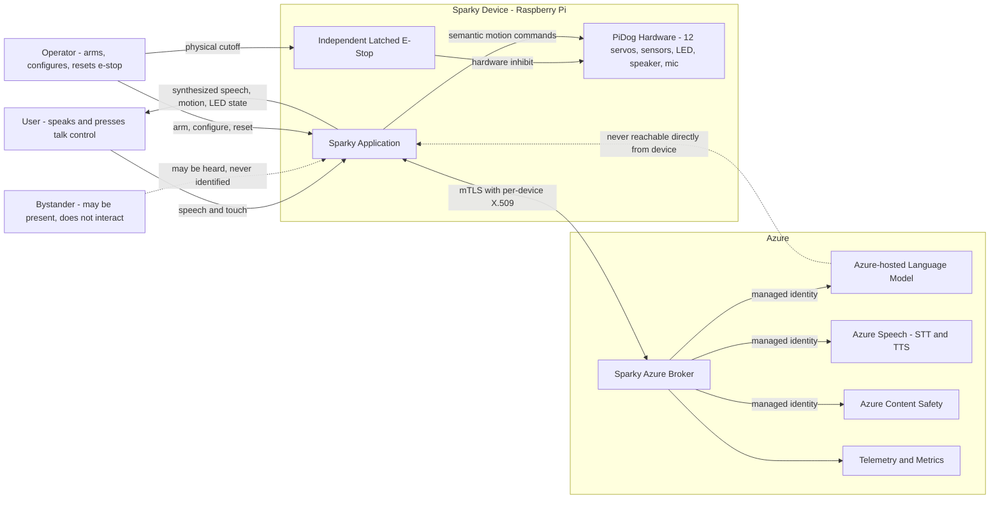

> Mermaid-rendering viewers may hide or suppress this block in some editors. The static SVG view is guaranteed to render in GitHub/Markdown viewers and is shown below.

**Reading the diagram:** the dashed line from the model to the app is a deliberate negative statement. The device holds no model credential and has no direct model route. The only Azure endpoint the device knows is the broker. See [ADR-0004](decisions/ADR-0004-azure-broker-identity-boundary.md).

### 7.3 Component diagram

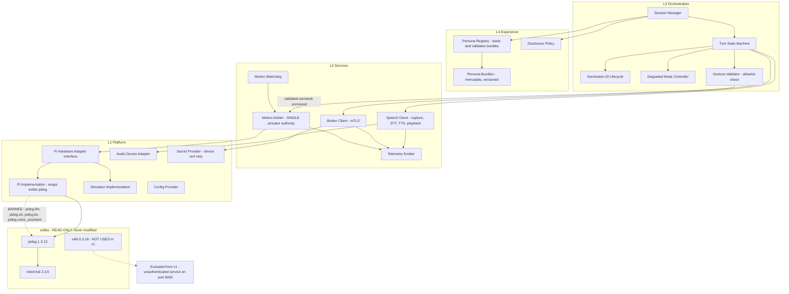

> Stable SVG render: this diagram is also available as a static image for viewers that do not render Mermaid.

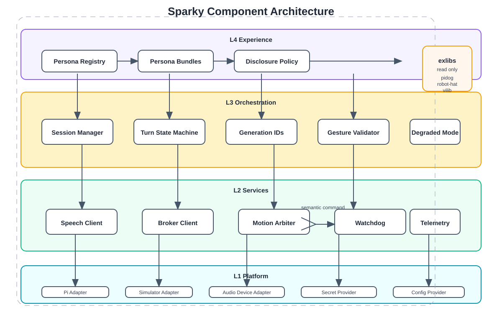

**Key invariants visible in this diagram:**

- `ARB` is the only component with an edge into `HAL`. Nothing else may write actuators (SR-05).
- `VAL` sits between the orchestration layer and the arbiter. No command reaches the arbiter without passing the allowlist check (SR-06, FR-14).
- `HALPI` and `HALSIM` are interchangeable behind `HAL` (NFR-05). This is what makes the whole stack testable without hardware.
- `VIL` is drawn only to state its exclusion.

### 7.4 End-to-end data flow

```mermaid
flowchart LR
    A["Talk control pressed"] --> B["Audio capture starts - generation ID issued"]
    B --> C["PCM audio buffer - held in memory only"]
    C --> D["Broker Client - STT request over mTLS"]
    D --> E["Azure Speech STT"]
    E --> F["Transcript text - in memory only"]
    F --> G["Content Safety check on input"]
    G -->|"blocked"| SAFE["Safe refusal line - persona voice"]
    G -->|"allowed"| H["Persona conditioning - system prompt, style, constraints"]
    H --> I["Azure-hosted Language Model"]
    I --> J["Reply text plus optional named gesture"]
    J --> K["Content Safety check on output"]
    K -->|"blocked"| SAFE
    K -->|"allowed"| L["Gesture Validator - is name in persona vocabulary"]
    L -->|"rejected"| M["Reply text only, no motion"]
    L -->|"accepted"| N["Semantic motion command with TTL and generation ID"]
    N --> O["Motion Arbiter"]
    M --> P["Azure Speech TTS - persona voice"]
    L --> P
    SAFE --> P
    P --> Q["Audio playback"]
    O --> R["Pi Hardware Adapter"]
    R --> S["Servos, tail, head, LED"]
    Q --> T["User hears reply"]
    S --> T

    C -.->|"discarded after request - never written to disk"| X["No retention"]
    F -.->|"discarded at session end - never written to disk"| X
```

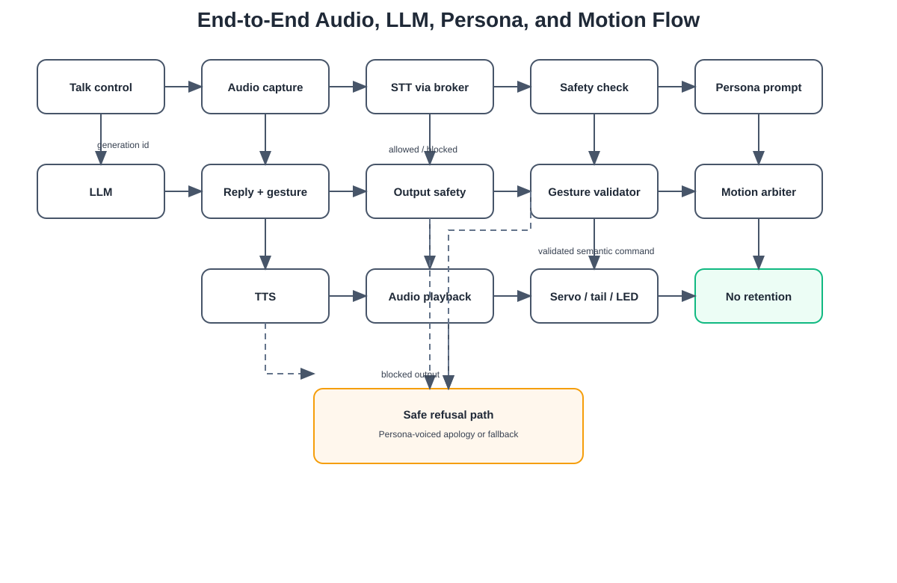

**What this flow deliberately shows:**

- Two content-safety checkpoints, one on input and one on output (PR-06), both of which route to a persona-voiced safe refusal rather than silence.
- The gesture validator is a hard gate, and its rejection path is *graceful* — the device still speaks, it just does not move. A rejected gesture is a telemetry event, not a user-visible failure.
- Both audio and transcript terminate at "no retention" (PR-01, PR-02). Nothing in this flow writes them to disk.
- The generation ID is issued at capture, not at synthesis. It travels with every artifact of the turn, which is what makes barge-in cancellation total rather than partial.

### 7.5 Key interaction and barge-in sequence

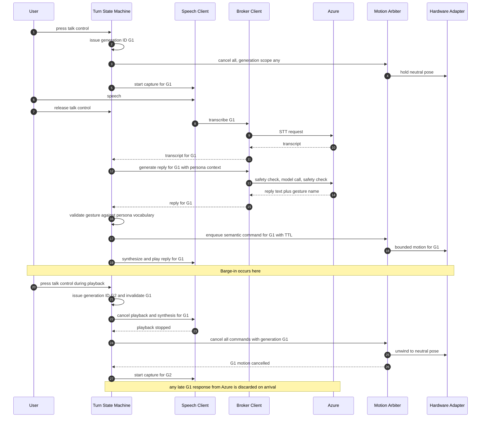

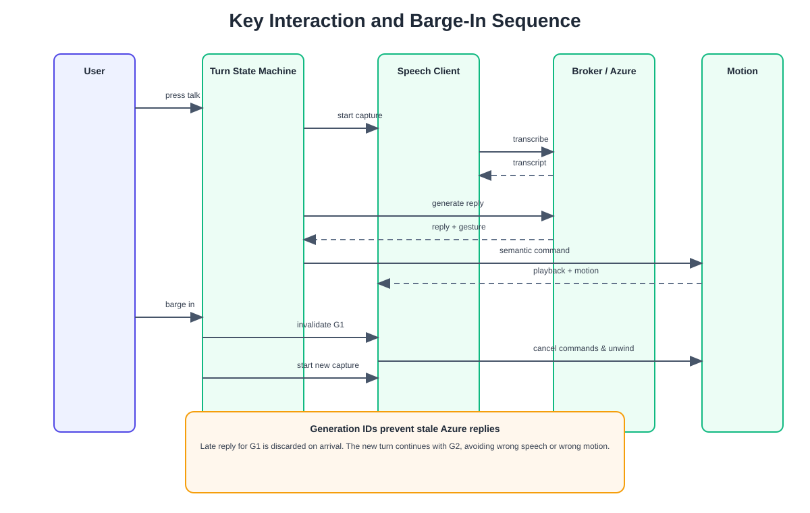

**Why generation IDs matter here:** the late-response case at the end is the defect this design exists to prevent. Without a generation ID, a slow Azure reply for the abandoned turn arrives after the user has already started a new one, and the device speaks the wrong answer over the new question while performing the wrong gesture. With generation IDs, the late response is discarded on arrival at zero cost.

### 7.6 Runtime state transitions

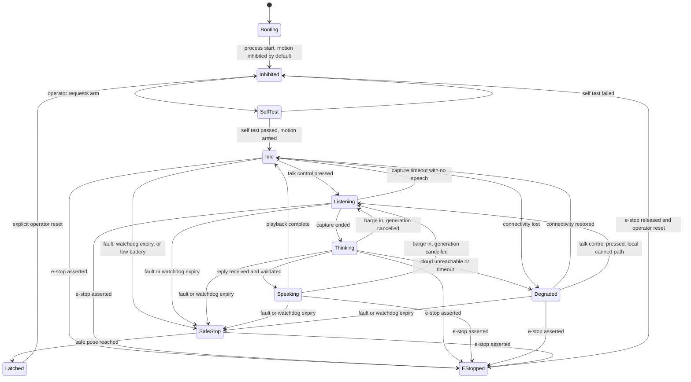

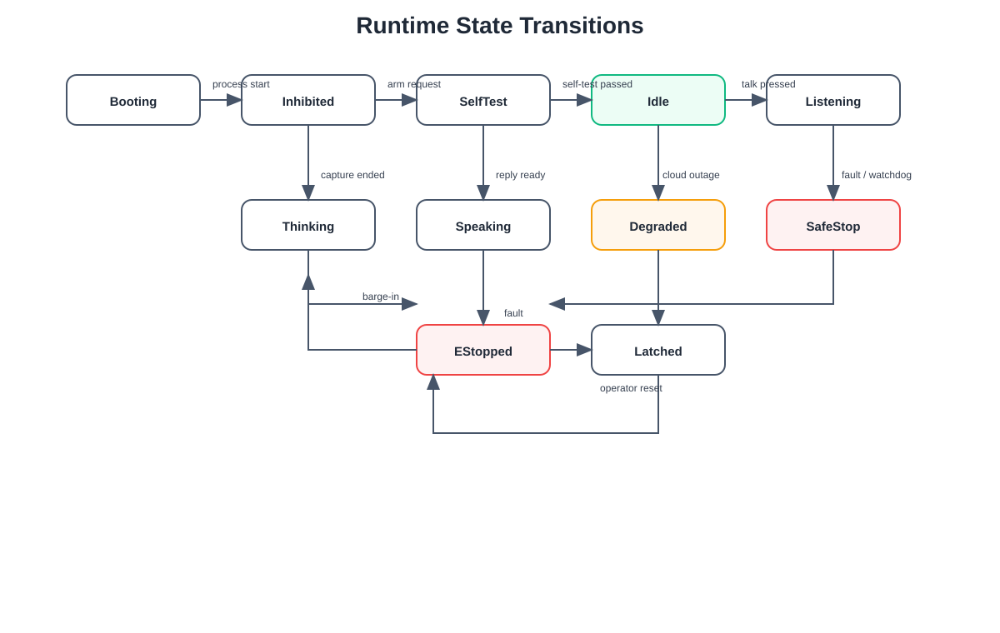

**State rules:**

| Rule | Statement |
|------|-----------|
| ST-01 | `Inhibited` is the only entry state after boot. Motion never begins without an explicit arm (SR-02). |
| ST-02 | `EStopped` is reachable from every operational state and is not exitable by software (SR-01). |
| ST-03 | `Latched` requires an explicit operator reset. Automatic recovery from a fault is forbidden. |
| ST-04 | `Degraded` is a first-class state, not an error. The device is fully responsive to physical controls in it. |
| ST-05 | Barge-in transitions from `Speaking` or `Thinking` directly to `Listening` without passing through `Idle`. |
| ST-06 | Only `Listening` may hold an open microphone. Half-duplex is enforced structurally by the state machine, not by convention. |

---

## 8. Persona Architecture

### 8.1 What a persona is

A persona is a **versioned, immutable bundle of five separable concerns**. It is data, not code. See [ADR-0003](decisions/ADR-0003-immutable-versioned-personas.md).

| Facet | Contains | Consumed by |
|-------|----------|-------------|
| **Prompt** | System prompt, style guidance, refusal style, disclosure phrasing | Broker Client, via L3 conditioning |
| **Voice** | Speech voice identifier, locale, prosody/rate/pitch adjustments | Speech Client |
| **Behavior** | Conversation policy — turn length, formality, verbosity, topic preferences, forbidden topics | Turn State Machine |
| **Motion vocabulary** | The **explicit allowlist** of named gestures this persona may request, drawn from the adapter's supported set | Gesture Validator |
| **Permissions** | Capability grants — may it request motion at all, may it use the camera if ever enabled, what content-safety strictness tier applies | Enforced at L3 before any downstream call |

Separating these five is what makes the model useful. A "calm assistant" persona and an "excitable puppy" persona differ in all five facets independently: you can give the calm persona a warm voice without giving it the puppy's jumping gestures, and you can restrict the puppy's permissions without rewriting its prompt.

### 8.2 Immutability and versioning

A persona bundle carries a `persona_id` and a `version`. Once loaded, the in-memory persona object is immutable for the life of the process. Editing a persona means shipping a new version, not mutating a live one.

This matters for three practical reasons:

1. **Attribution.** Every telemetry event and every log line carries `persona_id@version`. When behaviour changes, we know exactly which bundle produced it.
2. **Concurrency safety.** A persona switch mid-turn cannot half-apply. The turn completes under the persona it started with, or is cancelled outright.
3. **Review.** Rai reviews a persona bundle at a specific version. An immutable bundle means that review stays valid.

### 8.3 Validation and fallback

Persona bundles are validated at load time against a schema, and validation is **fail-closed with a defined fallback**:

| Failure | Behavior |
|---------|----------|
| Bundle fails schema validation | Bundle rejected. Not loaded. Logged as a startup error. |
| Bundle requests a gesture not in the adapter's supported set | Bundle rejected at load. This is a hard stop, not a runtime surprise. |
| Bundle requests a permission not granted by device config | Bundle rejected at load. |
| Bundle requests an unavailable Speech voice | Bundle loads with a configured default voice and a loud warning. Degraded, not fatal. |
| The configured default persona fails to load | The system loads the built-in **minimal safe persona**: neutral voice, no motion permission, plain refusal style, disclosure on. The device still works and is still honest. |
| No persona at all can be loaded | The system starts in `Inhibited` and refuses to enter `Idle`. It does not run persona-less. |

The minimal safe persona is not a decoration. It is the reason a broken persona file cannot brick the device or, worse, produce an unbounded-motion device with no behavioural constraints.

### 8.4 Adding and switching personas

**Adding** a persona is: drop a new versioned bundle in the persona directory, restart or trigger a registry reload. No core code changes (FR-07). The registry rejects invalid bundles without affecting the running persona.

**Switching** at runtime is: request a switch by `persona_id`, the session manager completes or cancels the current turn, releases the current persona, and applies the new one at the next turn boundary (FR-06). Switching never interrupts a turn mid-flight, because a half-switched turn would mix one persona's prompt with another's voice.

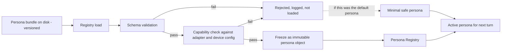

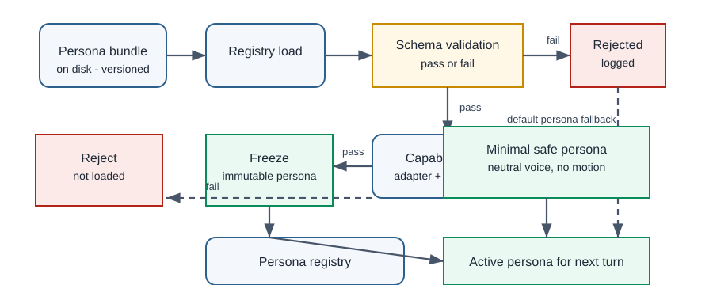

---

---

## 9. Azure AI and Azure Speech Approach

### 9.1 The identity boundary

The device is physically accessible. Anything stored on it is compromised the moment someone picks it up. Therefore the device holds **exactly one** credential: a per-device X.509 client certificate used for mTLS to the Sparky Azure Broker. Nothing else. No model key, no Speech key, no subscription key, no connection string.

The broker holds a **managed identity** within Azure and is the only party that talks to the language model, Speech, and Content Safety. See [ADR-0004](decisions/ADR-0004-azure-broker-identity-boundary.md).

| Property | Device | Broker |
|----------|--------|--------|
| Credential | Per-device X.509 client cert | Azure managed identity |
| Revocation | Individual device revocation without touching others | Azure RBAC |
| Knows model endpoint | ❌ No | ✅ Yes |
| Knows Speech key | ❌ No | ✅ Yes, via managed identity |
| Can be rate-limited per device | ✅ Yes, at the broker | — |
| Cost attributable per device | ✅ Yes, at the broker | — |

The broker gives us four things that a direct-to-Azure device cannot have: per-device revocation, per-device rate limiting, per-device cost attribution, and a single place to change model or region without touching devices.

### 9.2 The direct Speech experiment

🧪 **EXPERIMENT — not a shipping path.** A direct device-to-Speech flow using short-lived tokens issued by the broker is retained as a time-boxed evaluation, on the hypothesis that it removes a network hop from the latency-critical audio path.

| Field | Value |
|-------|-------|
| Hypothesis | Direct Speech streaming measurably reduces first-syllable latency vs brokered audio |
| Success criterion | A measured, reproducible latency improvement that materially changes perceived responsiveness |
| Abandon criterion | No material improvement, or any requirement to hold a credential on the device beyond a short-lived scoped token, or complexity that compromises the revocation story |
| Time box | Set in M2; abandoned by default if inconclusive |
| Gate | Blocked by **UD-10**. Not started until the user rules on whether the broker is mandatory. |
| Default if UD-10 unresolved | Broker-only. The experiment does not run. |

### 9.3 Resilience posture

| Concern | Approach |
|---------|----------|
| Transient failure | Bounded retry with jittered backoff and a hard per-turn deadline. Retries never outlive the generation ID. |
| Timeout | Every cloud call has an explicit timeout. There is no unbounded wait anywhere in the turn path. |
| Circuit breaking | Repeated failures open a breaker and move the device to `Degraded` rather than retrying into a dead network. |
| Partial failure | STT succeeded but the model failed → persona-voiced apology. Model succeeded but TTS failed → the turn is logged and the device signals via LED rather than pretending. |
| Late responses | Discarded by generation-ID check on arrival. |
| Cold start | The device never blocks `Idle` on a warm cloud connection. Connectivity is probed in the background. |

### 9.4 Content safety

Content safety is applied at **two** points (PR-06): on the transcript before it reaches the model, and on the model output before it reaches synthesis. Blocking at either point produces a persona-voiced safe refusal, never silence and never a raw error string. Strictness tier is a persona permission (§8.1), with the strictest tier as the default while UD-04 is unresolved.

### 9.5 What is not decided

Model selection, API version, SDK version, region, quota, throughput, and cost are all **⛔ not asserted** (NA-01 through NA-05) and are blocked by **UD-09**. No provisioning may proceed and no latency target may be published until that decision is made and M2 measurement is complete.

---

## 10. Hardware Abstraction and Motion Safety

### 10.1 The adapter

All access to `exlibs` goes through a single Pi-local hardware adapter interface. See [ADR-0001](decisions/ADR-0001-pi-local-hardware-adapter.md).

**The adapter's contract:**

| Rule | Statement |
|------|-----------|
| HA-01 | No component outside the adapter implementation may import `pidog`, `robot_hat`, or `vilib`. Enforced by a CI import check. |
| HA-02 | The adapter exposes semantic operations — `perform_gesture(name)`, `set_posture(name)`, `read_distance()`, `read_touch()`, `read_imu()`, `set_indicator(state)`, `go_safe_pose()`, `read_battery()`. It does not expose joint angles to callers. |
| HA-03 | The adapter must **never** import `pidog.llm`, `pidog.stt`, `pidog.tts`, or `pidog.voice_assistant` (EV-05, EV-07). |
| HA-04 | The adapter must **never** start the Vilib Flask service (EV-08, EV-09). |
| HA-05 | At least two implementations exist and are interchangeable: `PiAdapter` and `SimulatorAdapter` (NFR-05). |
| HA-06 | The adapter clamps leg and tail commands, because `exlibs` does not (EV-13). Head clamping in `exlibs` (EV-12) is treated as defence in depth, not as the primary guard. |
| HA-07 | The adapter surfaces the version and identity of the underlying libraries at startup and refuses to arm if they do not match the pinned, validated set. |

The adapter is the *only* place where the robot-hat `2.3.6` vs `2.5.x` skew (EV-02, EV-04) has to be reasoned about. That containment is the entire point.

### 10.2 The motion arbiter

Exactly one component writes actuators (SR-05). See [ADR-0002](decisions/ADR-0002-deterministic-motion-arbiter.md).

| Mechanism | Behavior |
|-----------|----------|
| **Semantic commands** | The arbiter accepts named gestures and postures from a static allowlist. It does not accept joint angles from any caller in the AI path (SR-06). |
| **TTL** | Every command carries a time-to-live. A command whose TTL expires before execution is dropped and counted, never executed late (SR-03). This is what prevents a queued gesture from firing thirty seconds after the conversation moved on. |
| **Cancellation** | Commands carry a generation ID. Cancelling a generation removes all its pending commands and unwinds any in-flight motion to neutral. |
| **Watchdog** | The arbiter must be serviced within a bounded interval. If it is not, the watchdog drives the device to the safe pose and latches (SR-04). |
| **Startup inhibit** | The arbiter starts inhibited and refuses all commands until explicitly armed after self-test (SR-02, ST-01). |
| **Determinism** | Given the same command sequence and the same clock, the arbiter produces the same actuator sequence. This is what makes it testable in simulation. |
| **Priority** | Safety commands preempt everything. Expressive gesture commands are the lowest priority and are dropped, not queued, under contention. |

The arbiter deliberately does *not* use PiDog's `body_stop()` busy-wait (EV-15) as its emergency primitive. It maintains its own command state and drives the adapter to a known safe pose directly.

### 10.3 Independent e-stop

The e-stop is **independent of software** (SR-01). It is not an arbiter feature, not a state in the state machine that software chooses to enter, and not a signal that a hung process can swallow. It is a latched physical cutoff. Software observes it and reports it; software cannot clear it. Clearing requires an explicit operator action at the device.

⚠️ **Blocked by UD-03.** The specification, sourcing, and wiring of this device are unresolved. **Hardware-in-the-loop testing does not begin without it** (M5 entry gate).

### 10.4 Motion scope

⚠️ **Blocked by UD-02.** The planning assumption is stationary-first: head, tail, posture, and gesture only, from the `preset_actions` vocabulary (EV-18). Walking is a separately gated milestone (M6) with its own safety envelope, floor requirements, and topple analysis. If the user chooses walking for v1, M6 moves ahead of M7 and the safety envelope work in M3 expands substantially.

---

## 11. Audio, Barge-in, Concurrency, and Shutdown

### 11.1 Half-duplex by construction

The first release is push/touch-to-talk and half-duplex. See [ADR-0006](decisions/ADR-0006-push-to-talk-half-duplex.md).

This is not a limitation we are apologising for; it is a deliberate simplification that removes three hard problems at once: acoustic echo cancellation, wake-word false accepts, and the always-listening privacy posture. The microphone is open only in `Listening` (ST-06), which is enforced by the state machine rather than by convention.

### 11.2 Barge-in mechanics

| Step | Action |
|------|--------|
| 1 | Talk control pressed during `Speaking` or `Thinking`. |
| 2 | A new generation ID is issued; the previous one is invalidated atomically. |
| 3 | Playback is stopped and the synthesis buffer is discarded. |
| 4 | All arbiter commands tagged with the old generation are cancelled; in-flight motion unwinds to neutral. |
| 5 | Capture starts for the new generation. |
| 6 | Any late cloud response for the old generation is discarded on arrival. |

The generation ID is the single mechanism binding speech and motion cancellation together (FR-08). Without it, the two subsystems would need to coordinate directly, which is precisely the coupling this architecture avoids.

### 11.3 Concurrency model

| Concern | Rule |
|---------|------|
| Actuator writes | Single-writer. Only the arbiter. No exceptions (SR-05). |
| Audio capture and playback | Never concurrent in v1 (ST-06). |
| Cloud calls | At most one in-flight generation. A new generation cancels the old. |
| `exlibs` threads | PiDog spawns daemon threads and a separate process (EV-14, EV-16). These are owned by the adapter and must not be touched from elsewhere. |
| Shared state | Persona objects are immutable (§8.2). Session state is owned by the session manager. Nothing else is shared mutable state. |
| Blocking | No blocking call in the turn path is unbounded. Every wait has a deadline. |

### 11.4 Shutdown

Shutdown is a safety operation, not a cleanup operation. In order:

1. Refuse new turns; the state machine stops accepting `Listening` transitions.
2. Cancel the active generation — stop playback, discard synthesis, cancel motion.
3. Drive the device to the safe stable pose and confirm arrival (SR-08).
4. Inhibit the arbiter.
5. Release the adapter, joining PiDog's threads and terminating its sensory process (EV-14, EV-16).
6. Flush telemetry.
7. Exit.

If any step fails or times out, the process still drives to safe pose and inhibits before exiting. A shutdown that leaves servos energized in an arbitrary pose is a failed shutdown. The same sequence runs on `SIGTERM`, on unhandled exception in the motion path (SR-07), and on operator-requested stop.

---

## 12. Privacy and Responsible AI

### 12.1 Defaults

| Default | Value | Requirement |
|---------|-------|-------------|
| Raw audio retention | **None** | PR-01 |
| Transcript retention | **None** | PR-02 |
| Camera | **Disabled** | PR-03, FR-13 |
| Vilib web service | **Never started** | PR-04 |
| Cross-session memory | **None** | UD-07 assumption |
| Transcript in logs | **Never at default level** | PR-05 |
| AI disclosure | **On** | FR-12, PR-07 |
| Content safety | **Strictest tier** while UD-04 unresolved | PR-06 |

These are defaults in the strong sense: they hold unless a user decision explicitly changes them, and changing them requires a Rai re-review.

### 12.2 Rai status

Rai's review status on this package is **🟡 AMBER — approved to plan, not approved to implement**, with blockers in three categories:

| Blocker | Category | Resolves via |
|---------|----------|--------------|
| RAI-B1 | **Safety** — no specified physical e-stop / cutoff / mute exists. | UD-03. Until resolved, no HIL testing is authorized. |
| RAI-B2 | **Safety** — bystander and child interaction model is undefined, so consent and content-strictness cannot be finalized. | UD-04 |
| RAI-B3 | **Privacy** — retention, deletion, and memory policy is undefined, so no retention feature may be built. | UD-07 |
| RAI-B4 | **Privacy** — Vilib's unauthenticated `0.0.0.0:9000` service (EV-08, EV-09) is an active exposure in the dependency tree. | Mitigated by ADR-0005 exclusion. The ban on this specific unauthenticated Flask/MJPEG service is **unconditional** — it does not depend on, and is not reopened by, UD-05. If UD-05 later confirms a camera is needed, that requires a **separately designed, authenticated** camera path, not this service; the broader camera-privacy question stays open and unresolved until then. |
| RAI-B5 | **Credential** — device credential model is unratified pending the broker decision. | UD-10, plus ADR-0004 implementation |

Rai's position, stated plainly: the architecture's *defaults* are correct and defensible, but three of the five blockers are user decisions that no amount of engineering can resolve. Amber is the correct status and it will not go green on documentation alone.

### 12.3 Transparency

The device discloses that it is an AI on session start and whenever asked (FR-12). A persona may style the disclosure; a persona may **not** suppress it or deny it (PR-07). This is enforced in the disclosure policy component at L4, above the persona prompt, so no prompt text can override it.

⚠️ Exact wording and trigger points are blocked by **UD-08**.

---

## 13. Observability, Cost, and Reliability

### 13.1 Telemetry

Every turn emits a structured event carrying: generation ID, `persona_id@version`, state transitions with timestamps, per-stage durations (capture, STT, safety-in, model, safety-out, TTS, first-audio), gesture requested, gesture accepted or rejected, cloud outcome, and error classification.

Every turn event explicitly **excludes**: audio, transcript text, reply text, user identifiers, and credentials (PR-05).

This split is what lets us debug latency and behaviour without building a surveillance system.

### 13.2 Key metrics

| Metric | Purpose |
|--------|---------|
| Per-stage turn latency distribution | Sets and holds the NFR-01 target once measured |
| Barge-in stop latency | NFR-02 |
| Gesture rejection rate | Detects a persona whose prompt asks for gestures it does not have |
| Safety block rate, input and output | RAI monitoring |
| Cloud error rate and breaker state | Degraded-mode tuning |
| Watchdog trip count | **Any non-zero value is a safety investigation**, not a metric to tune |
| E-stop assertion count | Safety audit |
| Battery voltage trend | SR-09 |
| Cost per turn, per subsystem | NFR-04 |

### 13.3 Cost

Cost is attributed at the broker, per device and per subsystem (STT, model, TTS, safety). This is a direct benefit of ADR-0004: a direct-to-Azure device gives no natural attribution point.

⛔ **No cost figures are asserted** (NA-05). A cost model is built from M2 measurement against the budget set in UD-09.

### 13.4 Reliability posture

Reliability's initial review of this package returned **❌ REJECTED**, specifically for unsupported, pre-asserted reviewer provenance — the package had asserted reviewer sign-off that was not genuinely earned through the actual review process. This was a provenance-integrity defect, not a technical one: Reliability's own assessment found the underlying acceptance criteria, hardware-abstraction/simulation test strategy, failure-mode coverage, and integration/HIL planning substantively sound and implementation-ready on the merits. The unsupported provenance claims were removed, and a genuine Reliability re-review of the corrected package has now returned **✅ APPROVE WITH CONDITIONS**. The conditions below, identified by Reliability's initial pass, are confirmed and embedded in the plan:

| ID | Condition |
|----|-----------|
| REL-C1 | Simulation must precede restrained HIL, which must precede controlled-floor testing. No skipping stages. |
| REL-C2 | The simulator adapter must be a first-class deliverable in M1, not an afterthought in M5. |
| REL-C3 | Every `MUST` requirement must map to at least one acceptance criterion before M0 exit. |
| REL-C4 | Safety requirements must be verified in simulation *and* on hardware. Simulation alone is insufficient for SR-01, SR-04, SR-07, SR-08. |
| REL-C5 | The soak test duration (OQ-07) must be fixed before M4 exit. |
| REL-C6 | Watchdog trips and e-stop assertions must be treated as defects with root-cause analysis, never as tuning parameters. |

---

## 14. Risks

| ID | Risk | Likelihood | Impact | Mitigation | Owner |
|----|------|-----------|--------|------------|-------|
| R-01 | Supplied libraries do not work on Bookworm 64-bit / Python 3.11 (AS-01) | Medium | High — blocks everything | M1 spike is the first milestone for exactly this reason; adapter isolates the blast radius | Robotics |
| R-02 | robot-hat `2.3.6` vs `2.5.x` skew forces a version choice with unknown consequences (EV-02, EV-04) | High | Medium | Adapter contains it (HA-07); OQ-01 pins a single source of truth in M1 | Robotics |
| R-03 | A dependency or example accidentally starts the Vilib service (EV-08) | Low | High — privacy breach | ADR-0005 exclusion, plus a CI import check (HA-01, HA-04) and a runtime port assertion | Rai + Robotics |
| R-04 | Cloud latency makes the interaction feel broken (AS-05, NA-01) | Medium | High — product-defining | Measured in M2 before any target is published; streaming synthesis evaluated (OQ-04) | Speech + AzureAI |
| R-05 | Cost exceeds an unstated budget (NA-05) | Medium | Medium | Per-turn cost telemetry from M2; budget set by UD-09 | AzureAI |
| R-06 | Unbounded or unsafe motion injures a person or damages the device | Low | **Severe** | Arbiter, TTL, watchdog, startup inhibit, allowlist, independent e-stop (§10); no LLM actuator access | Robotics + Rai |
| R-07 | HIL testing begins without a physical e-stop | Low | **Severe** | Hard M5 entry gate; UD-03 blocks it structurally | Reliability |
| R-08 | Simulation fidelity is insufficient and defects only appear on hardware (AS-08) | Medium | Medium | Restrained HIL stage between sim and floor; simulator is a first-class M1 deliverable (REL-C2) | Reliability |
| R-09 | Late cloud responses cause the device to answer the wrong question | Medium | Medium | Generation-ID invalidation (§11.2) | Architect |
| R-10 | A persona bundle requests capabilities it should not have | Medium | Medium | Load-time capability validation, fail-closed, minimal safe persona (§8.3) | Architect + Rai |
| R-11 | Device certificate compromise via physical access | Low | Medium | Per-device certs, individual revocation, no other credential on device (ADR-0004) | AzureAI |
| R-12 | GPLv3 licensing of `exlibs` constrains distribution (EV-21, §6.3) | Unknown | Unknown | Flagged for legal review before any distribution decision | Architect |
| R-13 | Ten unresolved user decisions stall the plan indefinitely | Medium | High | Decisions surfaced explicitly in §4 with named blocking milestones | Architect |
| R-14 | Scope creeps into walking, camera, or wake-word before the safety envelope supports it | Medium | High | Explicit non-goals (§1.3), gated milestones M6/M7 | Architect |
| R-15 | The device speaks something harmful | Low | High | Dual content-safety checkpoints, strictest default tier, persona-voiced refusals (§9.4) | Rai |

---

## 15. Implementation Readiness

### 15.1 Readiness checklist

| # | Item | Status |
|---|------|--------|
| 1 | Architecture documented, reviewed, and complete | ✅ This document |
| 2 | Project plan documented with phases and acceptance criteria | ✅ [project-plan.md](project-plan.md) |
| 3 | All six consequential recommendations captured as ADRs | ✅ [decisions/](decisions/) |
| 4 | Read-only `exlibs` assessment complete with citations | ✅ §5.2, §6 |
| 5 | Fact Checker verification of core claims | ✅ Core claims verified; runtime, SDK, quota, latency remain open items |
| 6 | Rai safety and responsibility review | 🟡 Amber — RAI-B1 to RAI-B5 open |
| 7 | Reliability test-readiness review | ✅ **APPROVE WITH CONDITIONS** — REL-C1 to REL-C6 confirmed at genuine re-review |
| 8 | Ten user decisions resolved | ❌ **All ten open** — §4 |
| 9 | **Dave Davis explicit approval of `system-architecture.md`** | ❌ **Not given** |
| 10 | **Dave Davis explicit approval of `project-plan.md`** | ❌ **Not given** |
| 11 | Physical e-stop specified and available | ❌ Blocked by UD-03 |
| 12 | Azure subscription, region, and budget confirmed | ❌ Blocked by UD-09 |
| 13 | Target hardware confirmed and available | ❌ Blocked by UD-01 |

**Items 9 and 10 are the gate. Both must be ✅ before any application/product code is written.** Items 1–8 and 11–13 govern *which milestone* may start once the gate opens; they do not substitute for the gate.

### 15.2 What would make this document wrong

Stated honestly, so that a reviewer can attack it efficiently:

- If M1 shows the supplied libraries do not run on the target image (R-01), the adapter design survives but the hardware baseline and possibly the whole platform choice must be revisited.
- If M2 measurement shows cloud latency is unacceptable (R-04), the half-duplex push-to-talk model may need to become a streaming model much earlier than planned, which changes ADR-0006.
- If UD-02 selects walking for v1, §10.4 and the entire M3 safety envelope expand, and R-06's mitigation set is insufficient as written.
- If UD-10 makes the direct Speech path mandatory rather than experimental, ADR-0004's identity boundary weakens and §9.1 must be rewritten.
- If UD-07 requires cross-session memory, §12.1's "no retention" default is void and an entire storage, encryption, and deletion design is missing from this document.

---

## 16. Cross-References

| Topic | Where |
|-------|-------|
| Package index and approval status | [README.md](README.md) |
| Phases, milestones, acceptance criteria | [project-plan.md](project-plan.md) |
| ADR-0001 — Pi-local hardware adapter | [decisions/ADR-0001-pi-local-hardware-adapter.md](decisions/ADR-0001-pi-local-hardware-adapter.md) |
| ADR-0002 — Deterministic motion arbiter | [decisions/ADR-0002-deterministic-motion-arbiter.md](decisions/ADR-0002-deterministic-motion-arbiter.md) |
| ADR-0003 — Immutable versioned personas | [decisions/ADR-0003-immutable-versioned-personas.md](decisions/ADR-0003-immutable-versioned-personas.md) |
| ADR-0004 — Azure broker and identity boundary | [decisions/ADR-0004-azure-broker-identity-boundary.md](decisions/ADR-0004-azure-broker-identity-boundary.md) |
| ADR-0005 — Privacy defaults and camera disabled | [decisions/ADR-0005-privacy-defaults-camera-disabled.md](decisions/ADR-0005-privacy-defaults-camera-disabled.md) |
| ADR-0006 — Push-to-talk half-duplex first release | [decisions/ADR-0006-push-to-talk-half-duplex.md](decisions/ADR-0006-push-to-talk-half-duplex.md) |
| Ten unresolved user decisions | [§4](#4-unresolved-user-decision-register-ud-01--ud-10) |

---

**Status: DRAFT — AWAITING APPROVAL. Implementation is BLOCKED until Dave Davis explicitly approves BOTH this document AND `project-plan.md`.**
